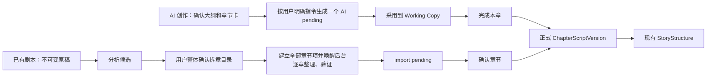

# 双流程来源与状态契约

## 1. 结论

AI 创作和已有剧本导入继续使用不同的上游过程，但都在“用户确认后的正式 `ChapterScriptVersion`”汇合。当前新增的是内部来源、状态和追溯能力，不新增 `ChapterPlan`，不改变剧本页及剧情结构页现有内容字段。

本契约已经实现的范围：

- 不可变完整原稿、文档和稳定原稿块。
- 原稿分析候选与整体确认后的拆章目录。
- 一个目录对应一个导入批次，目录内每章对应一个独立批次项。
- 每章忠实度报告和导入待确认稿。
- AI/导入两类待确认稿的精确来源绑定。
- 导入待确认稿直接确认成正式版本，禁止采用、丢弃或进入 Working Copy。
- AI 创作 A2～A4 的严格生产 Prompt：恰好 3 个灵感候选、四区块大纲与等量章节卡、固定六区块单章正文；格式失败最多做一次仅格式修复。
- A4 只响应当前章节的明确生成指令；裸“继续”、章节切换和批量生成表达都不会创建 AI pending。
- A4 在模型调用前冻结确认大纲、目标章节卡和必要的前章正式正文，写入时再次校验 `sourceSetDigest`，来源变化则拒绝落稿。
- A5 在现有正文区域完整只读展示 AI pending，保留采用/丢弃；采用后进入 Working Copy，完成本章才发布正式版本。
- 完成本章后停留当前章，仅在确认大纲存在下一张章节卡时新增下拉入口；切换到下一章仍不触发生成。

已有剧本 B1～B5 现已接入生产链：

- B1：对话上传或粘贴完整原稿，先保存不可变原稿版本、文档和稳定 block。
- B2：使用严格输出契约生成观察性大纲、章节候选、来源边界、证据、警告和阻断问题；用户反馈会生成完整新候选，不覆盖旧候选。
- B3：结果卡确认最新目录一次，创建不可变 `ScriptChapterMap`、全部章节入口和一个导入批次。
- B4：目录确认请求在批次入库后立即返回；专用后台 Worker 逐章 materialize、verify，单章失败隔离，成功项形成密封 `kind=import` pending。
- B5：用户自由切换章节，在现有正文区完整只读查看；点击“确认章节”直接形成正式 `ChapterScriptVersion(origin=import)`。
- 超长原稿按稳定 block 预算形成连续叶子片段，先分别严格分析，再按相邻片段递归合并；技术分段不得被当成剧情章节边界，最终候选仍须通过全原稿完整覆盖校验。
- 页面轮询只读批次投影；失败章节显示“重试本章”，只重置该 item，不修改目录、成功 pending 或正式章节。
- `script-import-normalize` Skill、生产 Prompt、严格 parser、对话结果卡、专用确认 API 和 DB-only 浏览器路径已接线。

本阶段明确边界：

- 导入 Worker 是本地单服务进程执行器，不宣称多实例分布式 lease 安全；数据库 batch/item 状态仍是唯一事实源，内存只保存已领取工作的唤醒信号。
- 分层分析消除了中段静默截断，但最终合并 JSON 本身仍受模型输出能力约束；超限时必须失败并保留原稿，不能降低覆盖要求。
- 页面内容字段不变；来源和批次只通过结果卡、章节状态和动作差异呈现。

## 2. 两条路线与汇合点



AI 创作路线仍保留“采用草稿 → 编辑正文 → 完成本章”三层语义。已有剧本路线没有采用、手动整理、AI 重新整理或丢弃动作；用户查看完整导入草稿后，只能确认该章或暂时不处理。

## 3. 领域产物

| 产物 | 职责 | 是否可变 | 是否是正式正文 |
| --- | --- | --- | --- |
| `ScriptRawSourceVersion` | 一次完整原稿输入的版本身份和总摘要 | 不可原地修改 | 否 |
| `ScriptRawSourceDocument` | 原稿中的一个上传文件或粘贴文档 | 不可原地修改 | 否 |
| `ScriptRawSourceBlock` | 供模型引用的稳定段落块 | 不可原地修改 | 否 |
| `ScriptImportAnalysisCandidate` | 观察性大纲、章节候选和来源范围 | 内容不可变；状态可从 active 结束 | 否 |
| `ScriptChapterMap` | 用户整本确认后的章节数量、顺序和来源边界决议 | 不可原地修改 | 否 |
| `ScriptImportBatch` | 一次整本导入整理的聚合状态 | 受状态机和 CAS 控制 | 否 |
| `ScriptImportBatchItem` | 一个章节的整理、验证、待确认和确认状态 | 受状态机和 CAS 控制 | 否 |
| `ScriptImportFidelityReport` | 指定输出相对指定原稿范围的忠实度证据 | 不可原地修改 | 否 |
| `ChapterScriptPending` | AI 或导入路线的完整章节候选正文 | 来源密封后不可改来源 | 否 |
| `ChapterScriptVersion` | 用户已确认的正式章节正文 | 不可变版本 | 是 |

`ScriptChapterMap` 不是章节计划。它只回答“原稿的哪些范围组成生产第几章”，不保存写作目标、场景卡、角色卡、beats 或 StoryStructure 字段。

## 4. 不可变原稿与稳定引用

原稿使用三层结构：

```text
ScriptRawSourceVersion
  └─ ScriptRawSourceDocument(sourceRef)
       └─ ScriptRawSourceBlock(blockRef, globalOrder, sourceDigest)
```

稳定规则：

- 文本统一去除 BOM、统一为 LF、去除首尾空白并保留一个结尾换行。
- 文档缺少显式 `sourceRef` 时按输入顺序生成 `source-001`、`source-002`。
- 文档内先按空行分块；单个无空行超长段落再按固定字符上限确定性切块，生成 `source-001:block-000001` 一类引用，避免一个巨段绕过长稿预算。
- 相同输入模式、内容类型、文件顺序和规范化文本产生相同 `sourceDigest`，重复保存按同项目幂等复用。
- 分析候选、拆章目录和忠实度报告必须引用同一原稿版本内真实存在的 block。

## 5. 拆章目录确认与批次

拆章目录确认是一次整本决策：

```text
active analysis candidate
  → confirmed analysis candidate
  → immutable ScriptChapterMap
  → one ScriptImportBatch
  → N ScriptImportBatchItem
```

启动批次前必须满足：

- `ScriptChapterMap` 属于当前项目且绑定精确原稿版本。
- 当前项目没有正式章节正文、非空 Working Copy 或 active pending。
- 现有空白章节的顺序必须属于确认目录；目录外多余章节会阻断，不会静默保留。
- 可复用的空白第 1 章会更新为确认目录中的标题；缺少的章节一次性建立。
- 同一个确认目录只能创建一个批次，重复请求返回原批次。

批次状态：

```text
queued → processing → ready_for_review → completed
                    ↘ partial_failure → processing
                    ↘ failed
```

章节项状态：

```text
queued
  → materializing
  → verifying
  → pending_ready
  → confirmed

materializing / verifying
  → generation_failed
  → materializing
```

单章失败不会回滚其他章节。只有全部章节至少完成一次整理/验证尝试后，批次才进入 `ready_for_review` 或 `partial_failure`。

后台执行规则：

- 目录确认只负责落库 `ScriptChapterMap/ScriptImportBatch/Item` 并返回 `queued` 投影，不等待 N 章模型调用。
- `ScriptImportWorkerService` 启动时执行一次恢复，新批次和显式重试通过主动唤醒进入执行；同一批次内部连续领取下一项，空闲时不高频查询 SQLite。
- Worker 一次只原子领取一个 `queued/generation_failed` item，再委托 `ScriptImportBatchService` 执行整理和验证。
- 服务重启时，残留 `materializing/verifying` item 先记录为 `IMPORT_WORKER_INTERRUPTED`，未超过 3 次自动尝试上限的项从本章起点重新处理；原有 `queued` 项继续执行。
- 页面 `GET import-batches/:batchId` 只读取数据库投影；`POST .../items/:itemId/retry` 只允许 `generation_failed → materializing`。

## 6. 两类待确认稿

`ChapterScriptPending.kind` 固定为：

| kind | 含义 | 允许动作 |
| --- | --- | --- |
| `legacy` | 0017 之前存在、无法可靠回填来源的旧待确认稿 | 保持现有采用/丢弃兼容 |
| `ai` | 基于已确认大纲和章节卡生成的 AI 创作候选 | 查看、采用、丢弃；采用后进入 Working Copy |
| `import` | 基于已确认原稿范围整理且忠实度通过的导入候选 | 完整只读查看、确认章节 |

新 `ai/import` pending 先写来源绑定行，再一次性写入规范来源投影、`sourceSetDigest` 和 `sourceSetSealedAt`。密封后不能改变 kind、策略或来源集合。

### 6.1 AI pending 来源策略

策略：`ai-chapter-generate/1.0`

必需来源：

- 当前项目已确认的 `ProjectScriptOutline`。
- 该大纲内目标章节的轻量章节卡及其独立摘要。
- 第 2 章及以后必须绑定上一章当前正式 `ChapterScriptVersion`。

目标章节已有正式正文、非空 Working Copy 或其他 active pending 时，不允许创建 AI pending。切换章节本身不调用该能力；必须由后续对话编排在用户明确要求“生成当前章节”时调用。

### 6.2 Import pending 来源策略

策略：`import-chapter-materialize/1.0`

必需来源：

- 原稿版本。
- 原稿分析候选。
- 已确认拆章目录。
- 当前目录项及其来源范围摘要。
- 当前批次章节项及整理输出摘要。
- 当前无硬问题忠实度报告。

Import pending 不能调用通用“采用草稿”或“丢弃草稿”。“确认章节”在单个事务内创建 `origin=import` 的正式 `ChapterScriptVersion`、推进章节到 `script_done`、清除 pending 并把对应批次项推进到 `confirmed`。

## 7. 下游门禁

- 任何 kind 的 pending 都阻断 StoryStructure 新工作。
- 导入 pending 使用独立原因码 `SCRIPT_IMPORT_PENDING`；旧/AI pending 继续使用 `SCRIPT_AI_PENDING`。
- 只有 `currentScriptVersionId` 指向正式版本、Working Copy 为 clean 且不存在任何 pending，才能进入现有剧情结构链。
- StoryStructure 的 payload 和页面字段没有变化，仍精确绑定正式 `sourceScriptVersionId`。

## 8. 数据库迁移与兼容

迁移：`0017_script_dual_flow_source_state`

变化：

- 新增 9 张来源/状态表。
- 原位扩展 `chapter_script_pending` 的 5 个来源字段，不重建旧表。
- 保留 0008/0009 已有的 pending 与章节触发器。
- 原有 pending 全部默认 `kind=legacy`，不伪造历史来源。
- 运行时 migration ledger、发布 Schema 身份、项目协调删除和 G1 post-overlay 白名单已包含 0017。
- G1 的 44 模型继续作为冻结基线；当前 Prisma Schema 是该基线加 9 个受 0017 小契约治理的 forward overlay 模型。

项目物理删除必须按外键顺序先清理 pending 来源、忠实度、批次项、批次、目录、分析、原稿块和文档，再清理既有章节与项目数据。

## 9. 三层字段边界

| 层 | 当前职责 |
| --- | --- |
| AI 输出 | 使用实施包 1 的严格大纲、章节、导入分析和忠实度 Schema，不生成数据库 ID |
| 服务端状态 | 补充项目/章节 ID、精确版本来源、摘要、批次状态、CAS 和用户确认结果 |
| 页面投影 | 继续显示现有大纲、章节正文和剧情结构字段；来源与批次信息只作为后续结果卡、状态和动作依据 |

## 10. 当前实现与后续增强

当前生产链已经完成 B1～B5，不再存在第二套 DB 导入写入路径。旧 `script-import.util.ts` 只服务 legacy file-mode 兼容；DB-only 路线统一经过不可变原稿、严格分析、确认目录、导入批次和专用逐章确认事务。

长稿分层、后台恢复和失败项重试已经完成。后续增强按以下边界推进：

1. 若未来需要多服务实例并行处理导入批次，应新增正式 lease owner/token/expiry 和抢占恢复契约，不能依赖当前单进程唤醒队列。
2. 继续扩充 P6 多文件跨边界、极端最终 JSON、更多忠实度反例和重启中断集成回归。
3. AI 创作路线只做评测、提示词迭代和体验修正，不重新引入批量生成、自动切章或“继续下一章”。
