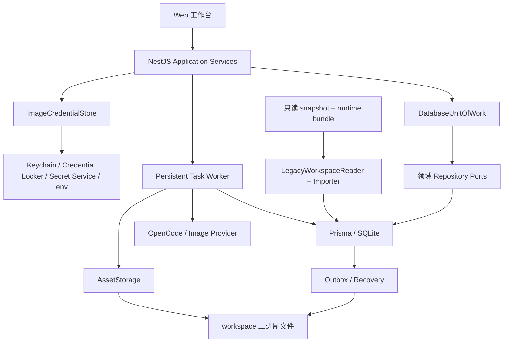

# G1 数据库事实源与 DB-only 切换开发方案

## 1. 最终结论

G1 不做“给现有六个 Prisma 模型补 CRUD”，而是完成一次可验证的事实源置换：

```text
当前：ProjectRepository Map + workspace JSON/Markdown + Tasks/Dialogue/Pending Map
  ↓
影子导入、对照、故障演练
  ↓
短暂停写 + 最终快照 + 一次切换
  ↓
目标：SQLite 唯一业务事实源 + workspace 只保存 Asset 字节
```

G1 必须同时接管：

- 项目、章节、剧本、剧情结构、分镜、出图准备、角色、素材、候选、旧布局和旧导出。
- 对话线程、消息、工具结果、OpenCode session 映射和所有待确认内容。
- GenerationTask、TaskAttempt、claim/lease/heartbeat、重试、取消和重启恢复。
- 文本/图片凭据分治后的非秘密配置和 SecretStore 引用。
- 数据库与文件之间的 staged/promote/ready、项目删除和补偿 Outbox。
- 旧数据来源、导入 provenance、异常、校验结果、切换和回滚证据。

如果只迁项目 JSON，而保留任务、对话或 pending 在内存，仍然不叫 DB-only。

## 2. 已确认事实

### 2.1 代码事实

- 当前 Prisma 6.19.3，schema 只有 Project/StoryVersion/Shot/Candidate/Asset/GenerationTask 六个未接线模型。
- 没有 `prisma/migrations/`、业务数据库、PrismaService 或 Prisma CRUD。
- `ProjectRepository` 用 Map 做 identity map，并顺序重写整棵 workspace 文件树。
- `TasksService` 用 Map 保存任务，创建后立即 `void` 运行 worker；`maxAttempts=1`，无持久 claim/lease。
- 候选图与角色/场景参考图分别维护 Promise 串行队列。
- `DialogueService.threads`、三类剧本 pending 和剧情结构 pending 全在内存。
- `SettingsService` 仍将文本和三类图片 key 明文写入 gitignored settings JSON。
- 当前项目删除顺序是先 `rm` 目录，再删内存任务和 Map；中途退出没有补偿记录。

### 2.2 真实数据事实

本轮对真实 workspace 只读盘点，不读取或输出 key：

| 项目 | 当前快照 |
| --- | ---: |
| Project | 1 |
| Chapter | 2 |
| 文件 | 82 |
| 总体积 | 约 54 MB |
| Character | 12 |
| Asset | 67 |
| 正式 Shot | 15 |
| Candidate | 27 |
| 唯一 taskId | 55 |
| 有完整 input/output artifact 的 taskId | 1 |
| 缺完整 artifact 的 taskId | 54 |

当前 67 条 Asset 均有物理文件，Character 和 Candidate 的主要引用完整；旧任务历史严重不完整，必须按 ADR-0012 导入 legacy stub，不能由文件存在推断成功任务。

## 3. 本阶段目标与非目标

### 3.1 目标

1. 建立可从空库重放的 Prisma migration history 和数据库健康检查。
2. 建立 G1 Schema 字典中的关系、版本、投影、current 指针、任务和运维模型。
3. 让临时测试项目在纯 DB 模式运行现有七阶段行为，不读写旧业务 JSON/Markdown。
4. 建立 SecretStore、持久任务、文件 Outbox、备份/恢复和项目删除闭环。
5. 建立只读审计、幂等导入、影子演练、停写切换和 DB-only 验收工具。
6. 用 DB 等价测试接替 G0 `migration_witness`，但不提前把 G2–G6 的红测写绿。

### 3.2 非目标

- 不重新设计七阶段 workflow。
- 不实现 D2 自动跨步骤调度。
- 不完成 G2 freshness、G3 创建版式 UI、G4 候选返修交互、G5 高自由画布或 G6 ZIP。
- 不升级 Prisma major，不引入 PostgreSQL、Redis、BullMQ 或多进程 worker。
- 不把图片/PDF/ZIP 字节塞进 SQLite。
- 不建设 DB + JSON 运行期双写，也不在 DB 错误时静默回退文件。
- 不把真实 workspace、真实 key 或用户内容复制成提交到 Git 的测试 fixture。

## 4. 目标架构



### 4.1 唯一写入口

- Controller 只调用应用服务，不直接访问 Prisma 或物理路径。
- Repository 不自行开启互相嵌套的事务；跨模型原子操作由 `DatabaseUnitOfWork` 拥有。
- Json 文档保存必须走 `DocumentCodec`。
- 文件生成必须走 `AssetStorage + Outbox`。
- 图片 key 只能走 `ImageCredentialStore`。
- 任务创建、claim、heartbeat、完成和恢复只能走 `PersistentTaskRepository/Worker`。

### 4.2 Repository 边界

目标端口：

```text
ProjectCatalogRepository
ChapterRepository
ScriptRepository
StoryRepository
StoryboardRepository
PreflightRepository
CharacterRepository
AssetRepository
CandidateRepository
LayoutRepository
ExportRepository
ConversationRepository
SettingsRepository
TaskRepository
MigrationRepository
DatabaseUnitOfWork
```

当前 `ProjectStore.writeProjectFiles(LocalProject)` 的“整聚合顺序重写”不能成为最终数据库 API。M1 可以临时提供只读兼容组装器，把关系行组装成现有 Workbench DTO；写入必须逐个迁到明确 command，不允许通过“缺行即 delete”的整聚合 upsert 隐式删除历史。

### 4.3 两种模式不是双写

实现期允许：

```text
AIROAMING_PERSISTENCE_MODE=file  -> 旧应用，仅用于切换前和契约对照
AIROAMING_PERSISTENCE_MODE=db    -> 新应用，唯一运行时事实源
```

同一进程、同一项目、同一请求绝不同时写两种存储。影子 importer 是离线“文件 reader -> 影子 DB writer”，不属于运行期双写。

M6 后删除 file 模式运行入口，只保留显式 LegacyWorkspaceReader/import/export 工具。

## 5. 数据目录和启动约束

### 5.1 路径

新增独立 `AIROAMING_DATA_ROOT`：

```text
{dataRoot}/
  db/airoaming.sqlite
  backups/{backupId}/
  migration-runs/{runId}/
  migration-staging/{runId}/
  legacy-metadata/{cutoverRunId}/
```

- DB 不放在 `workspace/projects`、NAS、共享盘、云盘同步目录或网络文件系统。
- workspace 继续由 `AIROAMING_WORKSPACE_ROOT` 管理 Asset 字节。
- 测试必须同时使用临时 dataRoot 和临时 workspace，并有 marker 防误删。
- DB 模式启动时 dataRoot 必须显式解析成功；不能失败后回退默认 workspace。

### 5.2 SQLite 首版参数

- 保持 SQLite 默认 rollback journal；G1 不默认开启 WAL。
- 每个进程只创建一个全局 PrismaClient，且首版只允许一个 NestJS 业务进程。
- 事务使用 SQLite/Prisma `Serializable`，且只包含短数据库操作。
- 启动验证 `foreign_keys=ON`；记录实际 `journal_mode/synchronous/SQLite runtime`。
- WAL、busy timeout、在线备份和 driver adapter 只有在 E0 实测后才能改变默认值。

备份分两层：M0 的数据库备份只验证关闭 Prisma 连接后的 SQLite 文件一致性；正式应用备份必须在 maintenance 下同时保存 DB、ready Asset 字节/manifest 和非秘密配置摘要。OpenCode auth 与系统 SecretStore 明文不导出，恢复后沿用当前系统凭据或要求重新配置。

SQLite WAL 仍只有一个 writer，并且不适合网络文件系统；备份还需正确处理 checkpoint。首版先使用关闭连接后的离线一致性备份，降低切换变量。参考：[SQLite WAL](https://www.sqlite.org/wal.html)、[SQLite Backup API](https://www.sqlite.org/backup.html)。

### 5.3 启动失败策略

DB 模式下遇到以下任一情况，Server 进入 unhealthy/maintenance 或直接退出：

- 数据库文件不可读写。
- migration history 与发布版本不兼容。
- `PersistenceState` 与启动模式不匹配。
- `PRAGMA quick_check` 非 `ok` 或 foreign key 配置未启用。
- 发现需要恢复的 running lease/outbox 但恢复器未成功启动。

禁止 catch 后加载旧 JSON。

`AIROAMING_MAINTENANCE_MODE=true` 只用于“启动即关闭写入”的 DB smoke/恢复场景。正式切换前的旧 file 进程不能靠重启进入维护，否则会先丢掉内存对话和 pending；它必须通过同一进程内的 `MaintenanceCoordinator` 从 `open -> draining -> closed`：先拒绝新写，再等待已进入的写请求/stream/task 收敛，最后生成 runtime bundle。控制入口只允许本机管理 CLI 使用，并使用一次性 nonce 或等价本地鉴权，不作为普通产品 API 暴露。

## 6. M0–M6 开发阶段

### 6.1 M0：契约、运行时探针和 migration 基础

#### 输入

- ADR-0012。
- `G1数据库Schema字典与旧数据映射.md`。
- G0 characterization 和 migration witness。
- 当前 Prisma 6.19.3、Node 22.17.1、macOS arm64 环境。

#### 开发项

1. 建 `persistence/`、PrismaModule、DatabaseUnitOfWork、DocumentCodec 与 digest 基础。
2. 增加 `AIROAMING_DATA_ROOT`、`AIROAMING_PERSISTENCE_MODE`、`AIROAMING_MAINTENANCE_MODE` 强校验，以及同进程 `MaintenanceCoordinator`/本地管理 CLI。
3. 建第一组 migration history，按 Schema 字典顺序拆分 SQL。
4. 在 migration SQL 中补 CHECK、trigger、复合约束和索引清单。
5. 建临时 SQLite 测试工厂、fake clock/ID 和 `db verify` CLI。
6. 运行 E0 探针：Json round-trip、DateTime、foreign key、短事务冲突、SQLite runtime、离线 backup/restore、Keychain adapter 可行性。
7. 固定 Prisma 6.19.3，不在同一阶段升级 7.x 或启用新 preview feature。

#### 允许写入

- 只写代码仓库里的 schema、migration、测试和临时测试目录。

#### 禁止写入

- 默认 workspace、真实项目、真实 settings、正式 dataRoot。

#### 退出闸门

- 空数据库可完整 `migrate deploy`。
- Prisma validate/generate/typecheck 通过。
- 关键非法行被数据库拒绝，不只被 TypeScript 拒绝。
- `integrity_check=ok`、`foreign_key_check=0`。
- backup 恢复后的 schema、计数和摘要一致。
- SecretStore E0 不存在明文文件 fallback。

### 6.2 M1：DB-only 新项目垂直切片

M1 不碰真实项目，先让临时项目完全走数据库。按以下子阶段推进，每个子阶段都有 Repository contract test：

#### M1.1 Project / Chapter / Script

- 创建、列表、打开、章节保存、完成、pending、重启恢复。
- current 指针和版本同事务。
- workflow 由数据库事实重建，不写 workflow 文件。

#### M1.2 Story / Storyboard / Preflight

- pending 与 confirmed 分离。
- 文档、投影和 current 指针同事务。
- 现有正式编辑 API 在 G1 兼容期可“写 pending/working 后立即发布新版本”，但不得修改已确认旧行；随后按 G2 已采纳契约改为完整显式发布、SourceSnapshot 与派生 freshness，详见 `2026-07-11_G2上游版本链与Freshness开发方案.md`。

#### M1.3 Character / Scene / Asset / Candidate

- 角色名项目内唯一。
- CharacterVisual/SceneVisual 与 Asset 关系化。
- 候选与 Shot/Asset/Task 同作用域。
- G1 只提供当前旧锁定行为的数据库兼容；新的 replace/clear/impact 由 G4 实现。

#### M1.4 Layout / Export 兼容

- 当前 `ChapterLayout` 进入 `LayoutWorkingCopy(documentKind=legacy_chapter_layout_v1)`。
- 当前导出行为可以读 DB，但 G0 已记录“一镜一页/复制源图”不是正式成功语义；G1 不为其增加错误绿测。
- 新的 LayoutDocument/ExportRevision 正式能力由 G5/G6 开启。

#### M1.5 Dialogue / pending / runtime session

- 对话线程、消息、工具结果、OpenCode session 映射全部持久化。
- pending import/seeds/outline、pending story、pending storyboard、pending script 重启保持。
- running assistant 在服务重启后收敛为 interrupted，不永久 running。

#### M1.6 Settings / SecretStore

- 非秘密设置入 DB。
- 文本 key 只交给 OpenCode auth；图片 key 只进 ImageCredentialStore。
- GET 不返回 keyPreview；日志、任务、artifact、DB 和导出中扫描不到测试秘密。

#### M1.7 Persistent Task Worker

- 实现 task policy registry、数据库创建、主动唤醒 + 扫描兜底、claim/lease/heartbeat、attempt、backoff、cancel、recovery 和 source projection。
- 用 TaskConcurrencySlot 统一所有图片任务并发 1。
- 移除 ImageCandidate/CharacterReference 各自的 Promise 权威队列。

#### M1.8 Asset/Outbox/删除

- staged/promote/ready 与恢复扫描。
- 项目删除先 `deleting + cancel request + Outbox`，文件成功删除后再按依赖顺序清 DB。
- 任何阶段崩溃后都能继续，而不是项目从 UI 消失、目录删一半、数据库无记录。

#### M1 退出闸门

- 临时 DB 项目通过现有七阶段已实现行为的 Service/API characterization。
- 关闭、重启 Server 后 project/chapter/pending/dialogue/task 状态保持。
- 将临时旧 JSON 改成错误值不影响 DB-mode 读取。
- DB-mode 业务动作不创建或更新 project/chapter/story/task JSON/Markdown。
- fake image provider 任务可重启、取消、故障恢复，图片通道最大并发为 1。

### 6.3 M2：只读审计、runtime bundle 和幂等导入器

#### M2.1 快照而不是直接读活动树

Importer 只接受不可变 snapshot：

1. 应用已停止，或进入全局 maintenance write gate。
2. 生成 pre-manifest。
3. 复制 workspace 项目文件；settings 原文件不进入普通 snapshot，只由 snapshot 工具在内存生成不含 key 的 `settings.redacted.json`（非秘密字段、configured、fingerprint）。
4. 生成 post-source-manifest；pre/post source manifest 不一致则本次 snapshot 无效。
5. 对脱敏、规范化后的 snapshot 另生成 snapshot manifest；MigrationRun 同时保存 `sourceManifestDigest` 和 `snapshotManifestDigest`，并用 transform 记录解释被脱敏/忽略的文件。

旧 task input/output/error 与 runtime bundle 在写入 snapshot/DB 前必须经过同一 `CredentialRedactor`。原文件摘要可作为证据保存，但检测到 Authorization/apiKey/token 等秘密时，只保留脱敏结构和原摘要，并产生 blocker 要求清理活动源；不得为了“完整历史”再复制一份含 key 的 artifact。无法解析的 Asset meta/task Json 保留摘要和 issue，只有在不影响引用且脱敏后才能降级导入。

两类 manifest 每项都包含 `storageKey/type/bytes/sha256`；source manifest 只计算原文件摘要而不复制秘密，snapshot manifest 描述 importer 真正读取的字节。mtime 只作诊断，不作业务时间。拒绝 symlink、路径越界和绝对路径。

#### M2.2 runtime bundle

当前对话和部分 pending 只在内存，最终停写时必须在旧进程退出前一次性捕获：

```text
Conversation threads/messages/tool results/session mappings
pending script import / inspiration seeds / outline
pending story structure
TasksService 当前终态任务快照
active stream/task 计数
```

- bundle 位于 migration staging，权限仅当前用户可读，带 schemaVersion/digest。
- 不含任何 key、Authorization 或 provider 原始敏感响应。
- active stream 必须为 0；queued/running/retrying 旧任务必须完成或取消，不能被直接转成新 runtime task。
- 导入成功并验证后删除 staging bundle；摘要和导入记录保留。

边界必须诚实：`MaintenanceCoordinator/runtime bundle` 代码需要先随 G1 bridge release 启动。该 release 启动前、旧版本进程内已经存在但从未落盘的对话/pending，无法在重启后凭空恢复。安装 bridge release 前必须让用户完成、采用、丢弃或明确放弃重要内存 pending，并在 MigrationReport 记录 `PRE_BRIDGE_RUNTIME_UNOBSERVABLE`；不能把“没有文件”写成“已迁移”。bridge 启动后新产生的运行态才由最终 bundle 完整捕获。

#### M2.3 导入顺序

```text
MigrationRun / decisions
  -> Project / Chapter
  -> Outline / Script Version / Script Pending / Revision
  -> Story Version / projection / ChapterScene
  -> Storyboard Version / Shot / projection
  -> Preflight
  -> 收集全部 taskId，先建 legacy_imported / legacy_stub
  -> Asset + 物理文件摘要
  -> CharacterVisual / SceneVisual
  -> Candidate / legacy lock revision
  -> Layout / Export
  -> Conversation / pending runtime bundle
  -> Provider metadata（秘密另走 SecretStore）
  -> 重建 workflow/read model
  -> 完整验证
```

#### M2.4 幂等键

```text
sourceKey = workspace-v1:<projectId>:<entityType>:<legacyId-or-relative-key>
```

- 有旧 ID 且经全量预扫描证明全局唯一时保留。`chapter_001/shot_001/script_outline_current` 等只在项目或章节作用域唯一的旧 ID，按 `projectId + entityType + legacyId-or-relative-key` 稳定重键；原 ID 由 ImportedEntitySource 保留。
- 导入新建的投影/证据 ID 由 `entityType + sourceKey` 的稳定摘要确定。
- 重键不得使用随机数、当前时间或导入顺序；两个 fresh DB 对同一 snapshot 必须产生完全相同的实体 ID。
- 同一 snapshot 导入同一 DB 两次，第二次实体新增数必须为 0。
- 相同 sourceKey 不同 digest 是冲突，不是 update。

#### M2.5 Secret 迁移

Shadow audit 只读 settings 的非秘密结构，不复制 key。最终切换才执行：

1. 旧 settings 只在内存读取。
2. 文本 key 写入 localhost OpenCode auth 并验证 configured/fingerprint。
3. 每个图片 key 写入新 secretRef 并读取验证 fingerprint。
4. DB 写 CredentialMetadata。
5. 写无秘密的 settings 临时文件并原子 rename 替换旧文件。
6. 通知同一 G1 file 进程重新加载非秘密设置、失效旧 credential cache，并清除对旧 key 字符串的持有。
7. 失败发生在 rename 前则旧文件未变；rename 后 file-mode 回滚版本也必须使用 SecretStore，不能重新生成明文副本。

不创建额外明文备份。完全回滚到不认识 SecretStore 的旧二进制时，图片 key 需要用户重新输入；不允许为了方便恢复 plaintext。

#### M2 退出闸门

- audit 只读，不改变 snapshot/真实源 hash 和 mtime。
- 报告具有 blocker/warning/info 与稳定 issueKey。
- 54 个缺 artifact taskId 在当前样例中生成 stub，不进入 active queue。
- import 同库两次无重复，两个空库结果的规范化报告一致。
- 报告、DB、staging 和日志不含测试 key。
- legacy task/dialogue/error payload 均经过统一 redactor；任何原始敏感字段命中都是 blocker，不以“旧数据”豁免。

### 6.4 M3：影子导入和双重对照

#### 每轮流程

1. 从同一不可变 snapshot 创建全新 DB。
2. `migrate deploy`。
3. 执行 importer。
4. 执行数据库、来源、文件和 API 四层校验。
5. 用 DB 模式启动、重启并读取所有阶段。
6. 销毁影子 DB；不把它当正式库继续写。

#### 四层校验

| 层 | 必须通过 |
| --- | --- |
| SQLite | `integrity_check=ok`、`foreign_key_check=0`、migration/check/trigger/index 清单一致 |
| 导入覆盖 | 每个 sourceKey 只有一个去向；blocker=0；实体计数和指针对照通过 |
| 文件 | ready Asset 全存在且 hash/bytes 匹配；物理孤儿单列；无越界/symlink |
| 公开行为 | file 模式与 DB 模式的 Project/Chapter/Workbench/Story/Storyboard/Preflight/Candidate/Asset 规范化 DTO 等价 |

双重稳定性：

- 同一 snapshot 导入两个空库，忽略 runId/时间/绝对测试路径后的 reportDigest 必须相同。
- 同一 DB 重复导入，第二次不得创建重复实体或降低 provenance。

#### DB-only 隔离试验

在影子副本中故意修改旧 `project.json/structure.json/storyboard.json`，DB-mode 响应必须不变；再执行 DB 业务写入，旧文件 hash/mtime 必须不变。该试验只操作临时副本。

#### M3 退出闸门

- 至少连续两轮 fresh shadow import 全绿。
- 当前真实 workspace 只读快照的报告稳定，所有 blocker 已处理。
- DB-mode restart/API 对照通过。
- 故障注入和 secret sentinel 扫描通过。

### 6.5 M4：正式停写与一次切换

正式切换只能在用户再次明确授权后执行。顺序固定：

#### C0：发布前

- 先部署同一套 G1 bridge release，以 `AIROAMING_PERSISTENCE_MODE=file` 启动；它具备 maintenance、runtime bundle、SecretStore 兼容和 file-mode 回滚能力，但仍不对用户项目双写 DB。
- bridge 期间任何新增/替换文本 key 都只交给 OpenCode auth，任何新增/替换图片 key 都直接写 SecretStore，并原子清除对应旧明文字段；禁止旧 SettingsService 再产生新的 plaintext。既有明文只允许存活到 C3/C4 迁移窗口。
- bridge 启动前让用户处理或确认放弃旧版本进程内的重要 pending/对话；不可观察部分进入迁移报告。
- G0 file-mode characterization 全绿。
- G1 全部自动测试全绿。
- 最后一轮 shadow 通过，代码与 importer 版本冻结。
- 记录应用版本、migration checksum、workspace manifest、数据目录空闲空间。

#### C1：进入维护

- 不重启旧进程，由本地管理 CLI 让 `MaintenanceCoordinator` 进入 draining/closed；所有新写 API、对话发送、任务创建返回 `503 MAINTENANCE_MODE`。
- 允许健康检查和只读查看。
- 等待已经进入的短写请求结束；请求运行任务协作取消或等待完成；拒绝产生新任务。
- active mutation、active streams、queued/running/retrying 旧任务全部为 0。
- 在同一旧进程内生成并封口 runtime bundle，之后才允许关闭进程。

#### C2：捕获与备份

- 捕获 runtime bundle。
- 保持旧 Server 同一进程存活但 closed，创建最终 workspace snapshot 和 manifest；C4 全部通过前不关闭它。
- 记录旧 settings 文件摘要，但不把明文内容复制进普通备份。
- 验证可用空间和备份可读。

#### C3：目标数据库与秘密预暂存

- 在正式 dataRoot 创建新数据库并执行 `migrate deploy`。
- 从旧 settings 只在内存读取文本/图片 key；完成 OpenCode auth 写入和图片 SecretStore 新 ref 写入，读取验证 fingerprint。
- 此时旧 settings 原文件保持不变；secretRef 只进入受保护的迁移上下文。若后续导入失败，清理新建 ref，旧 file 模式仍可继续。
- 扫描 staging/log，不得出现 key 原文。

#### C4：最终导入、校验与明文清除

- 导入最终 snapshot + runtime bundle，并在同一目标 DB 写 ProviderConfig/CredentialMetadata 的非秘密引用。
- 完成所有 M3 校验。
- 只有数据库和 secretRef 校验全部通过后，才写无秘密 settings 临时文件并原子 rename 替换旧文件。
- 通过本地维护控制让仍存活的 G1 file 进程 reload settings、失效内存凭据缓存；该版本本身必须支持从 SecretStore 读取图片 key。
- 再次扫描 DB、settings、staging、report 和 log，key 原文必须为 0。
- `PersistenceState=ready_for_activation`，`firstBusinessWriteAt=null`。
- C4 在明文清除前失败时，清理目标 DB/新 secretRef 并让仍存活的旧进程重新 open。明文已经清除后发生故障时，不再删除当前有效 secretRef；先确认旧进程已 reload SecretStore，再重新 open，绝不恢复明文 settings。

#### C5：DB 模式维护启动

- C4 全绿后才关闭旧 file 进程；runtime bundle 继续作为开放新写入前的回滚证据。
- 以 `AIROAMING_PERSISTENCE_MODE=db + AIROAMING_MAINTENANCE_MODE=true` 启动。
- 读取项目列表和每个章节工作台；运行 CLI ephemeral transaction smoke，并在同一事务 rollback，不留下业务行或设置 firstBusinessWriteAt。
- 旧 metadata 仍不参与读取。
- 失败则停 DB 版本并执行“开放写入前回滚”。

#### C6：封存旧 metadata

不能把整个项目目录设为只读，因为图片 Asset 仍在其中写入。必须：

1. 把 `project.json/workflow.json/chapter.json/script*.md/structure/storyboard/preflight/candidates.json/layout.json/task artifact/shared metadata` 等元数据复制或移动到 `{dataRoot}/legacy-metadata/{runId}`。
2. 保留 Asset 字节原路径不动。
3. 长期档案只含脱敏元数据和 manifest，权限只读；被 secret scanner 命中的旧 artifact 只归档脱敏结构和原摘要，不移动/复制原文明文。
4. 逻辑完整但已按 secret 规则脱敏的 workspace 回滚快照只保留到观察期/回滚退出，不作为运行时来源。
5. 活动 workspace 中没有可被旧 Repository误读的当前业务 JSON。

#### C7：激活

- 将 `PersistenceState` 原子切到 `db_only` 并记录 activatedAt。
- 重新开放写入。
- 第一个业务写事务填 `firstBusinessWriteAt`，此后不能回 file-only。
- UI 显示 DB-only 健康状态，旧 metadata 只作为历史档案。

### 6.6 M5：DB-only 观察期

观察期按证据退出，不仅按天数退出。至少完成：

1. Server 正常重启三次，项目、pending、对话和任务历史保持。
2. 创建一个可删除的测试项目，完成章节保存/结构 pending/分镜 pending 的 DB 往返。
3. fake provider 任务执行中杀进程：安全任务恢复，未知外部副作用任务 needsReview，图片不重复 current 回写。
4. running 任务取消且 provider 迟到，claim token/source guard 阻止污染。
5. 在 staged/promote/ready 各故障点杀进程并恢复。
6. 删除测试项目，验证 deleting/Outbox/文件/DB 最终一致。
7. 执行一次协调应用 backup（离线 DB + ready Asset 字节/manifest + 非秘密配置）-> 新 dataRoot/workspace restore -> read-only/API smoke。
8. 修改 legacy metadata 档案副本不影响 DB；DB 写不改档案。
9. 对当前真实项目逐阶段查看；不要求在 G1 用错误排版/目录包完成“伪 exported”。

每次启动：

- 检查 schema contract、foreign keys、quick_check、过期 task/outbox lease。
- 小库可执行 foreign_key_check；完整 integrity_check 在切换、备份和发布闸门执行。

### 6.7 M6：删除运行期旧路径

- 删除 `ProjectRepository` 的业务 Map 和 `saveProject` 整树重写职责。
- 删除 file-mode bootstrap 和查询 fallback。
- `TaskArtifactService` 只保留显式诊断导出，不再参与新任务事实。
- 保留 `AssetStorage`、LegacyWorkspaceReader、显式 import/export 和 backup/restore 工具。
- 删除业务 Promise 队列，所有任务只由 PersistentTaskWorker 领取。
- 用 DB 等价测试替换 G0 `migration_witness` 后，才删除旧文件重启测试。
- 旧 metadata 档案和完整切换备份的删除需要用户另行确认；M6 不自动销毁。

## 7. 持久任务详细契约

### 7.1 执行策略注册表

每个 task type 必须登记：

```text
input codec / output codec
idempotency key builder
source binding builder
concurrency key
max attempts / backoff
lease-expiry replay policy
artifact registration policy
cancel capability
```

没有登记完整策略的类型不能创建 runtime task。

### 7.2 首版时序

建议初始参数，全部由 fake clock 测试：

- DB scan：2 秒。
- lease：60 秒。
- heartbeat：15 秒。
- 明确可重试错误 backoff：5 秒、30 秒、120 秒，最多 3 次。
- `image-provider` slot：1。

参数可以配置，但不能改变状态机语义。

### 7.3 claim fencing

1. Scheduler 只选 `recordKind=runtime + queued/retrying + due + not cancelled`。
2. 短事务保留 concurrency slot、条件更新 task、生成唯一 claimToken、创建 TaskAttempt。
3. heartbeat 和完成都必须匹配 taskId + claimToken + running。
4. 过期或旧 worker 即使返回结果，也无法更新 Attempt、Task、Asset current 或业务 current 指针。
5. attempt 终结、释放 slot、清除 lease 与任务状态更新同事务。

### 7.4 过期 lease 重放矩阵

| 类型 | 首版未知中断策略 |
| --- | --- |
| 本地、确定性、幂等的渲染/打包 | 校验现有 staging/ready 产物后可 retry |
| OpenCode/LLM 调用 | 默认 `WORKER_INTERRUPTED + needsReview`；只有能证明请求未提交或 provider 支持可靠 request id 时才自动重放 |
| 图片生成/编辑 | 默认 needsReview，不在未知外部副作用下自动再次收费调用 |
| 明确收到 timeout/rate-limit 且当前 worker仍掌握 claim | 可按 policy 有限重试 |

“可自动重试”按任务策略明确列白名单，不使用“所有 retryable=true 都重试”的通用判断。

### 7.5 取消

- queued/retrying：条件更新为 cancelled。
- running：只写 cancelRequestedAt，通知本机 AbortController。
- worker 确认停止后才写 cancelled；若 provider 无法取消，迟到结果只能进入临时诊断/清理，不可正式回写。
- cancel requested 后 lease 过期，恢复器可结束为 cancelled，并由 claim token 阻止旧 worker。

### 7.6 legacy 隔离

数据库 CHECK、claim SQL 和服务 API 三层都必须证明：

- `legacy_imported/legacy_stub` 无 lease、attempt、retry 或 cancel。
- legacy stub status=null。
- 重新生成创建新 runtime task，在 source 中引用旧 taskId；不是 retry 旧记录。

## 8. 文件与数据库一致性

### 8.1 生成 Asset

```text
provider 结果
  -> workspace 临时目录写文件
  -> 关闭文件、读取尺寸、计算 bytes/sha256
  -> 短事务：Asset(staged) + pending 业务关系 + Outbox(asset.promote)
  -> 事务外：同文件系统原子 rename 到最终 storageKey
  -> 短事务：Asset ready + 激活业务关系 + 完成 Outbox
  -> 所有必需 Asset ready 后，Task succeeded
```

- UI 只能展示/定稿关联 ready Asset 的对象。
- final 已存在时必须比较摘要；相同视为幂等成功，不同为冲突。
- 临时目录与最终路径必须位于同一文件系统，保证 rename 语义。

### 8.2 故障恢复

| 故障点 | 恢复 |
| --- | --- |
| 临时文件写完、DB 未建 staged | orphan temp 扫描按 TTL 删除；无业务事实 |
| staged 已提交、rename 前崩溃 | Outbox 根据 temp 摘要继续 promote |
| rename 后、ready 前崩溃 | final 摘要匹配则标 ready；不匹配标 failed/needsReview |
| ready 后、task 完成前崩溃 | idempotency 检查已有 Asset/业务关系，再完成 task |
| ready Asset 文件缺失 | Asset -> missing，健康检查报警；不能继续作为 current 输入 |

### 8.3 项目删除

```text
事务：Project deleting + runtime task cancelRequested + project.delete_files Outbox
  -> 文件 worker 幂等删除项目 Asset 树
  -> 事务：按引用顺序清业务历史和 Task/Asset，完成 Outbox，删除 Project
```

删除过程中项目不接受新任务或写入；失败保留 deleting 状态和可重试记录。

## 9. SecretStore 详细契约

### 9.1 接口

```ts
interface ImageCredentialStore {
  put(input: { credentialId: string; secret: SecretString }): Promise<SecretMetadata>;
  get(credentialId: string): Promise<SecretString>;
  delete(credentialId: string): Promise<void>;
  probe(): Promise<CredentialStoreHealth>;
}
```

实现不得提供“列出全部明文”接口；`SecretString.toString/toJSON/inspect` 必须脱敏。

### 9.2 平台策略

- macOS：Keychain 是当前开发平台的必须通过项。
- Windows：Credential Locker。
- Linux 桌面：Secret Service。
- 无桌面会话：只读环境变量或由外部部署密钥提供主密钥的加密存储。
- 平台不支持时明确报错，不回退普通 JSON；主密钥不得与密文并排。

平台 adapter 的具体维护库在 M0 E0 后冻结；已归档的 keytar 不能未经评估成为长期唯一依赖。

### 9.3 replace/clear 顺序

替换：

1. 写新 versioned secretRef。
2. 读取并验证 fingerprint。
3. 短事务切 CredentialMetadata 指针。
4. 通过 Outbox 删除旧 ref。

清除：

1. DB 标记 clearing/unconfigured，阻止新任务读取。
2. Outbox 删除 secret。
3. 成功后状态 unconfigured；失败留下可恢复 error，不把旧 key 返回前端。

### 9.4 脱敏

所有请求、异常、provider 响应和 Json 在持久化前递归清洗：

```text
authorization, apiKey, api_key, token, accessToken,
password, secret, credential, cookie, set-cookie
```

验收使用唯一 fake secret sentinel，扫描 DB 文件、workspace、migration report、task payload、日志和导出物，出现一次即失败。

## 10. 切换回滚边界

| 时点 | 允许动作 | 禁止动作 |
| --- | --- | --- |
| shadow | 丢弃影子 DB，旧应用继续 | 让影子 DB 承接正式写入 |
| final import 前或 C4 失败 | 清理影子/目标产物，让仍存活的旧进程重新 open | 部分导入后同时开放两边写 |
| `ready_for_activation` 且 firstBusinessWriteAt=null | 停 DB，恢复 workspace 快照和 runtime bundle，使用同一 G1 版本 file 模式 | 用更旧且不认识 SecretStore 的二进制恢复明文 settings |
| DB-only 已有 firstBusinessWriteAt | 回滚到兼容当前 schema 的应用，或恢复协调应用 backup | 直接启动 file-only；旧 metadata 已不包含新写入 |

Prisma Migrate 不提供本方案可依赖的自动 down migration。应用回滚采用 expand/contract、兼容二进制和数据库备份。参考：[Prisma development/production migrations](https://www.prisma.io/docs/orm/v6/prisma-migrate/workflows/development-and-production)。

## 11. 计划代码结构

实现时建议新增：

```text
apps/server/prisma/migrations/**
apps/server/src/persistence/
  persistence.module.ts
  database-unit-of-work.ts
  prisma/prisma.service.ts
  repositories/**
  documents/**
apps/server/src/migration/
  legacy-workspace-reader.ts
  snapshot-manifest.service.ts
  runtime-bundle.service.ts
  migration-audit.service.ts
  migration-import.service.ts
  migration-verify.service.ts
apps/server/src/secrets/
  image-credential-store.ts
  secret-string.ts
  credential-redactor.ts
  adapters/**
apps/server/src/tasks/
  persistent-task-worker.ts
  task-policy-registry.ts
  task-recovery.service.ts
apps/server/src/assets/
  asset-storage.ts
  asset-recovery.service.ts
  outbox-worker.ts
apps/server/src/cli/
  db-snapshot.ts
  db-audit.ts
  db-import.ts
  db-verify.ts
  app-backup.ts
  app-restore.ts
  db-activate.ts
```

现有 `projects/project-repository.service.ts` 在过渡期改名或包裹为 `LegacyWorkspaceProjectReader`，避免新代码误以为它仍是正式 ProjectRepository。

## 12. 每阶段提交纪律

- 每个 M 子阶段独立提交 schema/代码/测试/文档，不把 M0–M6 压成一个 commit。
- 每次 schema 变化同时提交 migration SQL、Prisma schema、数据字典和约束测试。
- 每次 Repository 切片同时提交 file/db contract 对照，直到 M6 删除 file runtime。
- 每次任务/文件故障修复都增加故障注入回归。
- 真实切换不得和功能 UI 大改、Prisma major 升级、模型 provider 变更同一发布。

## 13. 风险与处理

| 风险 | 处理 |
| --- | --- |
| G1 变成 G2–G6 大爆炸 | 只建稳定关系与兼容文档；业务交互按阶段所有权后置 |
| 整聚合 upsert 丢历史 | 读可组装 DTO，写必须迁到明确 command + UoW |
| live copy 得到混合文件状态 | 只导入 maintenance/停机生成且前后 manifest 一致的 snapshot |
| runtime Map 在停机时丢失 | maintenance 退出前捕获无秘密 runtime bundle |
| 旧 task 被当 runtime 重试 | recordKind/check/claim/API 三层隔离 |
| SQLite 写竞争 | 单业务进程、短事务、网络/文件事务外、故障测试 |
| partial index 依赖版本漂移 | 当前 Prisma 6.19 使用 current 指针/scopeKey/slot 表，不依赖新 preview |
| 文件与 DB 半完成 | staged + Outbox + idempotent rename + recovery |
| 旧 metadata 与 Asset 同目录 | 只迁移/封存元数据文件，保留二进制路径可写 |
| 备份包含明文 key | settings 不进入普通 snapshot；SecretStore 验证后原子脱敏，不创建新明文副本 |
| 切换后想回 file 模式 | firstBusinessWriteAt 明确不可逆边界；之后只回滚兼容 DB 应用或协调应用 backup |

## 14. 官方资料复核

- Prisma SQLite Json/Enum 支持及 SQLite enum 不具数据库级强制：[SQLite connector](https://www.prisma.io/docs/orm/v6/overview/databases/sqlite)。
- Prisma migration SQL 可定制，history 应进入版本控制：[Prisma Migrate](https://www.prisma.io/docs/orm/prisma-migrate)、[customizing migrations](https://www.prisma.io/docs/orm/prisma-migrate/workflows/customizing-migrations)。
- `migrate deploy` 只应用 pending migration，不检测数据库 drift，因此本方案另做 schema/check/trigger 清单校验：[migrate deploy](https://www.prisma.io/docs/cli/migrate/deploy)。
- SQLite 只支持 Serializable；官方建议 interactive transaction 保持短小，避免网络和慢操作：[Prisma transactions](https://www.prisma.io/docs/orm/v6/prisma-client/queries/transactions)。
- SQLite foreign key 默认不能依赖编译时设置；应用要显式开启，并分别运行 `integrity_check` 与 `foreign_key_check`：[SQLite PRAGMA](https://www.sqlite.org/pragma.html)、[SQLite foreign keys](https://www.sqlite.org/foreignkeys.html)。
- SQLite 支持 UNIQUE/NOT NULL/CHECK/FOREIGN KEY，CHECK 在写入时验证：[SQLite CREATE TABLE](https://www.sqlite.org/lang_createtable.html)。
- SQLite Online Backup API 可创建一致性 snapshot；G1 首版先采用维护期关闭连接后的离线备份：[SQLite Backup API](https://www.sqlite.org/backup.html)。

## 15. Scrutiny Review

### 通过项

- 已把项目、任务、对话、pending、settings、文件补偿和迁移 provenance 纳入同一 DB-only 边界。
- 没有把二进制文件或明文 key 放入业务数据库。
- 明确 file/db 适配器只做模式切换，不做同项目双写。
- 明确 current 指针、版本文档和投影的短事务边界。
- 明确 runtime bundle，避免只迁文件却漏掉切换当刻仍在内存的内容。
- 明确旧 metadata 与 Asset 同目录问题，切换不粗暴 chmod 整个项目目录。
- 明确旧任务不可执行、图片并发 1、claim token fencing、未知外部副作用不盲目重跑。
- 明确切换后首次业务写是 file-only 回滚终点。

### 实施前仍需 E0 证明

- 当前 Prisma/SQLite runtime 对 Json、DateTime、复合外键、定制 trigger 和离线备份的真实行为。
- macOS Keychain adapter 的写入、读取、替换、删除、锁屏/权限失败和不泄密日志。
- SQLite 连接参数、journal/synchronous 和异常退出恢复。
- migration runtime bundle 在维护 gate 下能完整捕获且不含秘密。

这些是 M0 探针，不是新的产品决策；探针失败时只能调整实现方式，不能降级为明文、双写或静默 fallback。

## 16. Runtime/User Review

本轮只写开发文档，没有修改 schema、创建数据库、迁移真实 workspace 或操作 SecretStore，因此 Runtime/User Review 尚不适用。未来实际实施必须按配套 `G1数据库迁移执行与验收清单.md` 留下真实证据后，才能把 G1 标记为完成。
