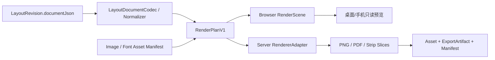

# G5 确定性渲染与出版导出契约

## 1. 文档状态与结论

本文定义 G5 的预检、渲染场景、出版 Profile、持久任务、不可变 ExportRevision、PNG/PDF/条漫切片和 manifest 契约。

- 当前状态为 `accepted`，尚未实现；接受契约不等于 renderer 或导出功能已经存在。
- 正式输出必须从不可变 LayoutRevision 生成，不能读取未保存 Working Copy。
- 编辑器 DOM、控制柄、画布库私有节点和“复制候选原图”都不是正式渲染器。
- E0 的首选验证路线是“业务 LayoutDocument → 专用 HTML/SVG RenderScene → 固定版本 Chromium 栅格化”，但在原型通过和补充技术 ADR 前不锁定实现库。
- SVG + 指定字体的原生栅格器作为 E0 对照路线；富文本竖排不通过时不能为了纯 SVG 牺牲已确认产品能力。

## 2. 为什么 G5 使用“出版版本”而非两个 current

G1 当前只有 `Chapter.currentExportRevisionId`。如果 PNG 与 PDF 各自创建独立 `kind` 并都竞争该指针，会产生：

- 页漫先导出 PNG、再导出 PDF 后，G6 不知道哪个是完整当前成品。
- 同一 LayoutRevision 的页面图和 PDF 被拆成两条不一致的来源/renderer 记录。
- 用户以为“导出一次”，数据库却需要维护两个 current。

因此 G5 把一次用户确认的成品输出定义为：

```text
ExportRevision.kind = layout_publication
```

| 项目版式 | 必需 Artifact | 可选 Artifact |
| --- | --- | --- |
| `paged_comic` | 每页一张 PNG | 同一批次 PDF |
| `vertical_scroll` | 按 Profile 切出的 PNG 序列 | 尺寸能力允许时的完整长 PNG |

一个 `layout_publication` 绑定一个 LayoutRevision、一个 ExportProfile、一个 rendererVersion 和一份 manifest。G6 只消费这个当前出版版本生成 ZIP，不在 G5 内做素材包。

G1 的 `kind=layout_png/layout_pdf` 在实施前收口为 `layout_publication/asset_package/video`；旧导出证据可作为 `layout_publication + origin=legacy_import + completionApplicability=legacy_unresolved` 导入，不再保留两个 runtime current。

## 3. 渲染边界



### 3.1 唯一正式输入

正式渲染只读取：

1. 不可变 LayoutRevision document/digest。
2. LayoutSourceBinding 与 sourceLockSetDigest。
3. 该修订引用的 ready 图片/字体 Asset 的字节、sha、metadata。
4. 规范化 ExportProfile。
5. 固定 renderer/policy 版本。

禁止读取：

- 当前 Working Copy 或浏览器本地未保存状态。
- Chapter 当前候选 ID 来替换修订中的历史来源。
- 客户端系统字体、本地绝对路径或任意网络 URL。
- 编辑器 DOM、选择框、辅助线、视口 zoom/pan 或 AI 对话状态。

### 3.2 RenderPlanV1

`RenderPlanV1` 是可重建的内部中间结果，不入数据库：

```ts
interface RenderPlanV1 {
  schemaVersion: 1;
  documentDigest: string;
  sourceLockSetDigest: string;
  profileDigest: string;
  rendererPolicyVersion: "layout_render_policy_v1";
  canvases: RenderCanvasPlanV1[];
  assets: RenderAssetManifestV1;
  diagnostics: RenderPlanDiagnosticV1[];
  renderPlanDigest: string;
}
```

`renderPlanDigest` 对规范化 plan 计算 JCS + SHA-256；不包含进程 ID、缓存目录、绝对路径、时间戳或 claim token。

## 4. E0 技术路线门禁

### 4.1 候选 A：交互 adapter + 专用 HTML/SVG 场景 + 固定 Chromium

当前首选验证，不是已锁定实现：

- 交互层可用 Konva/Fabric/SVG adapter 负责命中、选择、变换和手势。
- 富文本输入使用 IME 安全的 DOM overlay，但落盘仍是 RichTextDocument。
- 预览和正式输出由独立 RenderScene 生成，不截图编辑器工作区。
- Server 使用与 Playwright 版本绑定的 Chromium binary，等待字体、图片和 scene ready 后按精确 clip 输出 PNG；页漫 PDF 使用同一 scene 的分页打印语义。

优势：CSS Writing Modes 已定义 `vertical-rl/text-orientation`，更有机会让中日文横竖排、IME 和 PDF 复用同一浏览器排版能力。

风险：Chromium/字体版本升级会改变像素，需要 hermetic binary、固定字体与 rendererVersion；长条 raster 内存需要切片。

### 4.2 候选 B：规范 SVG + resvg 栅格化

- Shared 生成显式 SVG；浏览器预览同一 SVG，Server 用 resvg + 指定字体输出 PNG。
- 关闭系统字体并直接加载 FontAsset buffer。
- 若竖排富文本、换列、标点、混合字符或 PDF 需要把每个 glyph 显式定位，必须把工作量写入评估，不能按“SVG 自带文字”假设通过。

优势：输入/输出边界小、无浏览器网络面，PNG 栅格过程易固定。

风险：复杂竖排、字符范围样式与 PDF 可能需要自建文字排版器，首版成本显著增加。

### 4.3 候选 C：浏览器 Canvas 与 Server Canvas/Skia 双实现

只作为失败备选。若浏览器与 Server 使用不同文字测量/换行实现，即使拖拽流畅也不能通过 E0。画布库的 stage/node JSON 不能成为正式文档。

### 4.4 原型组合

E0 至少实现两条完整薄切片：

| 原型 | 交互 | 富文本输入 | 正式 PNG | 目的 |
| --- | --- | --- | --- | --- |
| A | Konva 或 Fabric adapter | DOM overlay | 专用 RenderScene + pinned Chromium | 验证主推荐路线 |
| B | SVG-native 或最小 adapter | DOM overlay/显式 runs | SVG + resvg（必要时 Chromium 对照） | 验证纯 SVG 确定性与竖排代价 |

原型代码可放临时 `prototypes/layout-editor-e0`，不得直接复制进生产页面。通过后新增技术 ADR，记录最终库、版本、binary 获取、字体包、失败路线和升级测试；未通过前 ADR-0011 保持不锁库。

### 4.5 E0 通过标准

功能 fixture 必须覆盖：

- 4 个画格、自由图片、旋转/重叠/裁切/翻转/边框。
- 横排与竖排富文本、字符范围字号/颜色/描边/粗体/斜体。
- 中文与日文 IME composition、标点、数字、拉丁字符和 emoji 缺 glyph。
- speech/thought/shout/caption 与单尾巴。
- 20 个条漫段落、切片边界、stale 换图和 crop 两种迁移方式。

量化闸门：

| 指标 | 最低要求 |
| --- | --- |
| 文档 round-trip | normalize → serialize → parse 后 digest 完全相同 |
| Undo/Redo | 连续 100 个混合命令往返后 digest 回到起点/终点 |
| 文字语义一致 | 浏览器工作预览与正式 renderer 的换行/换列、run 边界、glyph 顺序完全一致 |
| 几何一致 | 关键元素外框/clip 边界误差不超过 0.5 逻辑单位 |
| 固定环境重复渲染 | 同一输入连续 3 次 PNG sha 完全相同；PDF 经规范 metadata/ID 后 sha 也相同 |
| 像素对照 | 固定 binary/font 下黄金图差异为 0；跨客户端浏览器只允许抗锯齿边缘差异，结构像素不得漂移 |
| 编辑性能 | 20 canvases/200 elements 场景 pan/drag p95 frame 不高于 32ms，pointerup 命令不高于 100ms |
| 正式输出 | PNG 可解码且尺寸正确；页漫 PDF 页数/尺寸正确；条漫切片可顺序无缝拼回 |
| 字体隔离 | 移除系统字体后结果不变；缺 FontAsset 明确失败 |

任一“文字语义一致、固定环境重复 sha、真实 PNG/PDF”不通过，都不能进入正式 E2–E8 开发。

## 5. RendererVersion 与能力

```ts
interface LayoutRendererIdentityV1 {
  rendererId: "airoaming_layout_renderer";
  rendererVersion: string;
  rendererPolicyVersion: "layout_render_policy_v1";
  geometryPolicyVersion: "layout_geometry_v1";
  textPolicyVersion: "layout_text_v1";
  balloonPolicyVersion: "balloon_shape_v1";
  rasterEngine: "chromium" | "resvg" | "other_approved";
  rasterEngineVersion: string;
  buildDigest: string;
}
```

- rendererVersion 是产物追溯字段，不是“永远相同”的承诺。
- 任何 browser/resvg/font/text policy 升级必须跑全部 golden；有像素或换行变化时升级 rendererVersion。
- 旧 ExportRevision 保留原 rendererVersion 和产物，不用新 renderer 重写。

能力对象：

```ts
interface LayoutRendererCapabilitiesV1 {
  maxCanvasWidthPx: number;
  maxCanvasHeightPx: number;
  maxRasterPixels: number;
  maxPdfPages: number;
  maxLongPngHeightPx: number;
  supportsPagedPdf: boolean;
  supportsLongPng: boolean;
  supportedImageMimeTypes: string[];
  supportedFontMimeTypes: string[];
}
```

这些上限由 E0 在目标 macOS/CI 环境验证后固化，不由客户端自报。V1 最低验收必须覆盖 `1800×2400` 页图、`1080×8192` 条漫切片和至少 40 页 PDF。

## 6. AssetResolver

### 6.1 浏览器预览

- 只通过已登录的 project-scoped Asset API 获取 blob；URL/缓存不写 LayoutDocument。
- 加载后核对 mime/尺寸，字体通过受控 FontFace 注册；等待 `document.fonts.ready` 和所有 image decode。
- 未 ready/missing/sha 不符时不降级到系统字体或空白图，显示正式预检问题。

### 6.2 Server renderer

- 不允许 RenderScene 自由访问网络或 `file://`。
- Chromium 路线使用 `page.setContent` 或受控 bundle；所有 `https://airoaming.invalid/assets/{assetId}` 请求由 Playwright route 依据 manifest 直接 fulfill。
- 未列入 manifest 的请求全部 abort；禁止 DNS、HTTP 外联、data URL 大字节和绝对路径。
- storageKey 必须经过 G1 path guard、symlink boundary 和 sha 验证后才读取。
- resvg 路线直接传受控图片/字体 buffer，`loadSystemFonts=false`。

### 6.3 图片规范

- 正式图片必须有 width/height、sha256、mimeType 和 `status=ready`。
- Asset ingestion 应把 EXIF orientation 规范到 1、颜色空间规范为 sRGB；未规范素材返回 `IMAGE_ORIENTATION_UNNORMALIZED` 或 `IMAGE_COLORSPACE_UNSUPPORTED`。
- V1 支持 PNG/JPEG/WebP 的静态首帧；GIF/APNG/视频不得静默取帧作为漫画图片。
- 解码器与颜色处理属于 rendererVersion。

## 7. 几何与绘制规则

### 7.1 像素映射

```text
outputPixel = logicalUnit * outputScale
```

`outputScale` V1 仅允许 1 或 2。所有数值先按 LayoutDocument 的 0.001 量化，再统一乘 scale；不能让浏览器 devicePixelRatio 改变正式尺寸。

### 7.2 图层和隐藏

- Canvas background 最先绘制。
- `elements[]` 从索引 0 到末尾绘制。
- hidden 元素及其复合内容完全跳过；locked 对输出无影响。
- Panel 内先绘制 clip 后的图片，再在内部绘制 border。
- normal alpha compositing；无 blend/filter/shadow。
- 旋转中心与 transform 顺序严格使用 LayoutDocument 契约。

### 7.3 画格裁切

- rect/rounded_rect clip path 由 Shared geometry 生成。
- cover 最小比例、offset、rotation、flip 使用同一矩阵实现。
- Server 重算 coverage；出现空洞直接阻断，不用背景色掩盖。
- 边框向内绘制，宽度在 outputScale 后精确缩放。

### 7.4 气泡路径

`balloon_shape_v1` 固定：

- speech：椭圆主体 + 平滑三角尾巴。
- thought：固定 12 个云朵瓣 + 泡泡式单尾巴。
- shout：固定 16 个内外半径交替尖角 + 尖角尾巴。
- caption：圆角矩形；默认无尾巴，但 schema 允许用户显式开启单尾巴。

路径只由 kind、transform、padding 和 tail 数值决定，不使用随机 seed、时间或浏览器测量。

## 8. 富文本和字体渲染

### 8.1 排版输入

每个 RichText run 必须解析到：

- 确切 FontAsset bytes/sha。
- fontWeight/fontStyle 可用 face。
- fontSize、letterSpacing、stroke、颜色。
- fixed writingMode/textOrientation/paragraph align/lineHeight。

不允许 CSS `font-family` 最后退回 `sans-serif`；所有 @font-face family 名由 Asset ID 派生，避免同名字体碰撞。

### 8.2 横排/竖排

- `horizontal-tb` 从上到下排段落、行内从左到右。
- `vertical-rl` 每列从上到下、列从右向左；`textOrientation=mixed/upright` 按固定 CSS/renderer policy。
- start/center/end 是流相对对齐，不写死 left/right。
- 段落换行/换列、标点和 fallback glyph 选择必须在浏览器预览与 Server 语义一致。
- V1 不实现 ruby、text-combine-upright 数字压缩、专业日文禁则、路径文字或逐 glyph transform。

### 8.3 溢出

排版器返回每个 Text/Balloon 的内容 bounds 和 overflow axes。任一可见 grapheme 未进入可绘制框即产生 `TEXT_OVERFLOW`，正式出版阻断；不能通过 `overflow:hidden` 静默裁掉。

### 8.4 缺 glyph

按 run primary FontAsset → document fallbackFontAssetIds 顺序逐 grapheme 解析。全部缺失时产生确定的 element/range issue；不能使用系统 emoji 或 tofu 方框当作成功。

## 9. 预览模式

| 模式 | 输入 | 是否可写 | 用途 |
| --- | --- | --- | --- |
| 编辑工作预览 | 浏览器本地当前 document | 可编辑 | 实时拖拽，允许尚未 autosave |
| 只读真实预览 | 同一 RenderScene + 当前 document | 否 | 无控制柄、无面板，检查最终视觉 |
| 手机预览 | 已保存 Working Copy 或 LayoutRevision | 否 | 条漫滚动/页漫翻页、切片与问题查看 |
| 出版结果预览 | ready ExportRevision Artifact | 否 | 查看真实 PNG/PDF |

- 编辑工作预览可以使用交互 adapter，但文本/气泡 render node 必须复用 Shared RenderScene 语义。
- “真实预览”不是对编辑器 DOM 截图，而是重新生成无编辑 UI 的 render-only scene。
- 手机 route 懒加载只读组件，网络测试必须证明未调用 Working Copy PUT、Revision POST 或 Export POST。
- 手机查看 Working Copy 时只读取最近成功保存版本，并明确显示“草稿预览 + updatedAt/digest”；不能展示桌面未保存内存状态。

## 10. LayoutPreflightReportV1

```ts
export interface LayoutPreflightReportV1 {
  schemaVersion: 1;
  policyVersion: "layout_preflight_v1";
  target: {
    kind: "working_copy" | "layout_revision";
    id: string;
    documentDigest: string;
    rowVersion: number | null;
  };
  sourceLockSetDigest: string | null;
  currentLockSetDigest: string | null;
  exportProfileDigest: string | null;
  status: "ready" | "warning" | "blocked";
  issues: LayoutPreflightIssueV1[];
  preflightDigest: string;
}

export interface LayoutPreflightIssueV1 {
  issueKey: string;
  code: LayoutPreflightCodeV1;
  severity: "error" | "warning" | "info";
  blockingScopes: Array<"revision" | "export">;
  requiresAcknowledgement: boolean;
  canvasId: string | null;
  elementId: string | null;
  shotId: string | null;
  details: Record<string, string | number | boolean | null>;
}
```

### 10.1 摘要

`issueKey` 是 `{code,canvasId,elementId,shotId,details}` 规范对象的短展示 key；`preflightDigest` 对以下完整对象 JCS + SHA-256：

```text
policyVersion
target.kind/id/documentDigest
sourceLockSetDigest/currentLockSetDigest
exportProfileDigest
按 issueKey 排序后的 issues（不含本地化 message/时间戳）
```

客户端文案不参与 digest；任何 document/source/profile/issue 变化都会使旧确认失效。

### 10.2 问题矩阵

| code | revision | export | 等级/处理 |
| --- | --- | --- | --- |
| `LAYOUT_SCHEMA_INVALID` | block | block | error |
| `LAYOUT_PROFILE_INVALID` | block | block | error |
| `ACTIVE_SHOT_UNPLACED` | block | block | error；每个 active Shot 至少一张图 |
| `ACTIVE_SHOT_NOT_VISIBLE` | block | block | error；唯一图片 hidden/opacity=0/完全画布外 |
| `SOURCE_LOCK_SET_INCOMPLETE` | block | block | error |
| `SOURCE_STALE` | block | block | error |
| `SOURCE_UNRESOLVED` | block | block | error |
| `SOURCE_DIGEST_MISMATCH` | block | block | error |
| `IMAGE_ASSET_MISSING_OR_NOT_READY` | block | block | error |
| `IMAGE_SHA_MISMATCH` | block | block | error |
| `IMAGE_ORIENTATION_UNNORMALIZED` | block | block | error |
| `FONT_ASSET_MISSING_OR_NOT_READY` | block | block | error |
| `FONT_EMBEDDING_FORBIDDEN` | block | block | error |
| `FONT_GLYPH_MISSING` | block | block | error |
| `TEXT_OVERFLOW` | allow | block | error for export，保存版本时 warning |
| `WORKING_COPY_AHEAD_OF_REVISION` | n/a | confirm | warning；推荐保存新版本，也可明确导出当前已保存版本并保留草稿 |
| `IMAGE_EFFECTIVE_RESOLUTION_CRITICAL` | allow | block | ratio < 0.5 |
| `IMAGE_EFFECTIVE_RESOLUTION_LOW` | allow | confirm | 0.5 <= ratio < 1，warning |
| `ELEMENT_FULLY_OUTSIDE_CANVAS` | allow | confirm | warning；若是唯一 Shot 图片另有 NOT_VISIBLE |
| `ELEMENT_PARTLY_OUTSIDE_SAFE_AREA` | allow | confirm | warning，仅文字/气泡/重要画格 |
| `CANVAS_EMPTY` | allow | confirm | warning |
| `HIDDEN_ELEMENT_PRESENT` | allow | info | info |
| `STRIP_CUT_CROSSES_CONTENT` | n/a | confirm | warning，切片线穿过可见对象 |
| `OUTPUT_DIMENSION_UNSUPPORTED` | n/a | block | error |
| `OUTPUT_PIXEL_LIMIT_EXCEEDED` | n/a | block | error |
| `PDF_NOT_SUPPORTED_FOR_FORMAT` | n/a | block | error |
| `RENDERER_CAPABILITY_MISSING` | n/a | block | error |

### 10.3 图片有效分辨率

从源图像像素到正式输出像素构造完整变换矩阵 `M`，取最大奇异值 `sigmaMax(M)`：

```text
effectiveResolutionRatio = 1 / sigmaMax(M)
```

含义：一个源像素最多覆盖多少输出像素的倒数。

```text
ratio >= 1.0        ready
0.5 <= ratio < 1.0 warning，用户每次导出明确确认
ratio < 0.5         block export
```

旋转、crop zoom 和 outputScale 都必须进入矩阵，不能只比较原图宽度和画格宽度。

### 10.4 warning 确认

- UI 必须展示全部 `requiresAcknowledgement=true` warning。
- Export request 发送 preflightDigest + 排序后的 acknowledgedIssueKeys。
- Server 在创建任务前重跑预检；digest 或 warning 集变化返回 409，不复用旧确认。
- 确认只属于这次 export request，不写回 LayoutDocument 或永久关闭预警。

## 11. LayoutPublicationProfileV1

```ts
export type LayoutPublicationProfileV1 =
  | PagedPublicationProfileV1
  | VerticalPublicationProfileV1;
```

### 11.1 页漫

```ts
interface PagedPublicationProfileV1 {
  schemaVersion: 1;
  kind: "paged_publication";
  outputScale: 1 | 2;
  includePdf: boolean;
  pdfPixelDpi: 96;
}
```

- 每页 PNG 永远必需；不能创建“只有 PDF、没有页面图”的当前出版版本。
- `includePdf=true` 后 PDF 就是本次 publication 的必需 Artifact；PDF 失败时整次出版失败，不把只有 PNG 的半套结果标 ready。
- PNG 尺寸精确为 PageProfile.width/height × outputScale。
- PDF page point 尺寸为 `logicalPx / 96 * 72`，无额外 margin/header/footer。
- PDF 页数等于 canvases.length，顺序一致；页面背景和字体与 PNG 使用同一 RenderPlan。

### 11.2 条漫

```ts
interface VerticalPublicationProfileV1 {
  schemaVersion: 1;
  kind: "vertical_publication";
  outputScale: 1 | 2;
  maxSliceHeightPx: number;
  cutPolicy: "prefer_section_boundary_then_exact";
  includeLongPng: boolean;
}
```

- PNG slice 序列永远必需；`maxSliceHeightPx` 范围 `2048..8192`，默认 8192。
- 段落按 canvases 顺序无缝拼接，切片 overlap 固定 0。
- 优先选择不超过 max 的最近 section boundary；单段过高或无法安全切时按精确像素切并产生 `STRIP_CUT_CROSSES_CONTENT` warning。
- `includeLongPng` 只有总高度/像素数不超过 renderer capabilities 时可用；不可用时 UI 禁用并解释，不静默忽略。
- `includeLongPng=true` 且已通过 preflight 后，long PNG 是本次 publication 的必需 Artifact；生成失败时整次出版失败。
- V1 不为条漫生成 PDF。

### 11.3 profileDigest

Profile 先 strict parse/normalize，再用 JCS + SHA-256。comicFormat 与 profile kind 不匹配直接拒绝。

## 12. ExportRevision Schema 细化

G1 `ExportRevision` 调整为：

```text
id, projectId, chapterId, revision, kind, status,
taskId,
layoutRevisionId, sourceLockSetDigest,
profileJson, profileSchemaVersion, profileDigest,
preflightDigest, rendererVersion,
manifestJson, manifestSchemaVersion, manifestDigest,
completionApplicability, origin,
createdAt, readyAt, failedAt, cancelledAt
```

枚举：

```text
kind = layout_publication | asset_package | video
status = queued | rendering | ready | failed | cancelled
origin = runtime | legacy_import
completionApplicability = current | historical | legacy_unresolved
```

约束：

- `(projectId, chapterId, kind, revision)` 唯一。
- runtime `layout_publication.taskId/layoutRevisionId/profileDigest/preflightDigest/rendererVersion` 必填。
- taskId 唯一；GenerationTask.targetType=`export_revision`、targetId=ExportRevision.id。
- queued→rendering→ready/failed/cancelled；ready 后所有来源/profile/manifest/status 不可改。
- queued/rendering/failed/cancelled 的 `completionApplicability` 为 null；ready 必须非空。manifestJson/manifestDigest 也只在 ready 时必填，不能在 queued 时伪造空 manifest。
- failed/cancelled revision 仍占用 revision number；用户重试创建新的 ExportRevision，不复活旧终态行。
- `completionApplicability` 只在终态 ready 登记；之后 current/stale 每次查询派生。

## 13. 导出用户流程与 API

### 13.1 流程

```text
flush Working Copy
  -> 若 Working Copy 比 current LayoutRevision 新：推荐“保存新版本并导出”，也可明确选择“导出当前已保存版本”
  -> 对 current LayoutRevision + ExportProfile 运行 preflight
  -> 浏览器 render-only 真实预览
  -> 用户确认 warnings
  -> 创建 layout_publication ExportRevision + persistent task
  -> worker 渲染/校验/落 Asset
  -> ready 后展示 PNG/PDF/切片与历史
```

AI 不得执行最后的用户确认或创建任务。选择导出当前已保存版本时，任务仍只读取 current LayoutRevision，已自动保存的 Working Copy 保持不变，并把 `WORKING_COPY_AHEAD_OF_REVISION` 作为本次必须确认的 warning。

### 13.2 Preflight API

```text
POST /api/projects/{projectId}/chapters/{chapterId}/layout/preflight
```

```ts
interface RunLayoutPreflightRequestV1 {
  schemaVersion: 1;
  target:
    | { kind: "working_copy"; expectedRowVersion: number; expectedDocumentDigest: string }
    | { kind: "layout_revision"; layoutRevisionId: string };
  profile: LayoutPublicationProfileV1 | null;
}
```

- 保存版本可 profile=null，只计算 revision gate。
- 导出必须 target=current LayoutRevision 且 profile 非空。

### 13.3 创建出版任务

```text
POST /api/projects/{projectId}/chapters/{chapterId}/exports/layout-publications
```

```ts
interface CreateLayoutPublicationRequestV1 {
  schemaVersion: 1;
  requestId: string;
  layoutRevisionId: string;
  expectedCurrentLayoutRevisionId: string;
  profile: LayoutPublicationProfileV1;
  profileDigest: string;
  preflightDigest: string;
  acknowledgedIssueKeys: string[];
}
```

Server 在一个短事务前后完成：

1. body/profile strict 校验。
2. 核对 Chapter current LayoutRevision。
3. 重新计算 source freshness、profile digest 和 preflight。
4. 核对全部 warning acknowledgement。
5. 生成 ExportRevision.id/revision 和 GenerationTask.id。
6. 同事务插入 queued ExportRevision、GenerationTask、GenerationTaskSource 和 concurrency input。

响应：

```ts
interface CreateLayoutPublicationResponseV1 {
  schemaVersion: 1;
  result: "created" | "replayed";
  exportRevision: LayoutPublicationSummaryV1;
  task: GenerationTaskSummaryV1;
}
```

### 13.4 request 幂等

```text
GenerationTask.idempotencyKey = layout-publication:{projectId}:{chapterId}:{requestId}
```

- 同 key 且 layoutRevision/profile/preflight 完全相同返回 replayed。
- 同 key 不同意图返回 409 `LAYOUT_EXPORT_IDEMPOTENCY_KEY_REUSED`。
- 用户明确再次导出使用新 requestId，创建新 ExportRevision，即使 document/profile 相同。

### 13.5 查询/取消

```text
GET  /api/projects/{projectId}/chapters/{chapterId}/exports/layout-publications
GET  /api/projects/{projectId}/chapters/{chapterId}/exports/layout-publications/{exportRevisionId}
POST /api/projects/{projectId}/chapters/{chapterId}/exports/layout-publications/{exportRevisionId}/cancel
```

取消只请求协作取消；ready 不能取消，旧 ready 产物不能被删除或覆盖。下载复用受控 Asset download API。

## 14. GenerationTask input/source

### 14.1 inputJson

```ts
interface LayoutPublicationTaskInputV1 {
  schemaVersion: 1;
  exportRevisionId: string;
  layoutRevisionId: string;
  documentDigest: string;
  sourceLockSetDigest: string;
  profile: LayoutPublicationProfileV1;
  profileDigest: string;
  preflightDigest: string;
  renderer: LayoutRendererIdentityV1;
  assetManifest: RenderAssetManifestV1;
}
```

`assetManifest` 保存 ID/mime/sha/width/height/font metadata digest，不保存字节、绝对路径、临时 URL 或 credential。

### 14.2 GenerationTaskSource

至少投影：

```text
role=layout_revision       sourceType=layout_revision
role=lock_set              sourceType=lock_set，sourceDigest=sourceLockSetDigest
role=candidate_lock        sourceType=candidate_lock_revision，每个唯一 lock revision
role=image_asset           sourceType=asset，每个图片 Asset
role=font_asset            sourceType=asset，每个字体 Asset
```

同 role 内 order 按稳定 ID 排序。任务来源在创建事务写入，worker 不从“当前项目”重建另一套输入。

### 14.3 任务执行配置

```text
type = layout_export
concurrencyKey = layout-render
全局并发槽 = 1
maxAttempts = 2
```

本任务没有外部计费副作用，claim/文件写入可幂等，因此已知中断可以安全重试；仍必须使用 G1 claimToken fencing。

## 15. Worker 阶段

```text
validate_input       0-5%
resolve_assets       5-15%
build_render_plan    15-25%
render_primary       25-70%
render_optional      70-80%
verify_outputs       80-88%
stage_assets         88-94%
promote_assets       94-98%
finalize_revision    98-100%
```

每次 phase/heartbeat 更新都要求 leaseOwnerId + claimToken。失去 claim 后旧 worker 立即停止写入；完成事务再核对 token。

### 15.1 临时目录

```text
.staging/tasks/{taskId}/{claimToken}/
```

- 只属于当前 attempt；不写入 Asset storageKey 或 manifest。
- retry 不复用未知旧临时字节；恢复程序可按 TaskAttempt/claim 清理。
- 任何路径都经过 workspace guard，禁止用户输入文件名。

### 15.2 输出验证

PNG：

- magic/mime 正确，可完整 decode。
- width/height 与 RenderPlan/Profile 精确一致。
- bytes > 0，sha256 可重算。
- 页/切片 order 连续且数量符合 plan。

PDF：

- header/trailer 可解析，未加密。
- 页数等于 Page canvases 数。
- 每页 MediaBox 尺寸符合 96px→72pt 规则。
- 字体按许可证与 renderer 方案正确嵌入/子集化；不能依赖查看机器字体。
- creation/modification time、document ID 和其他非语义 metadata 必须规范化或移除；固定输入/renderer 连续三次 PDF sha 应一致。

条漫切片：

- 每片 width 一致，height 不超过 Profile。
- 按顺序无 overlap/缺口拼接后等于完整 RenderPlan 像素流。
- 最后一片允许更短。

## 16. 文件、Asset 与 Outbox

正式 storageKey：

```text
projects/{projectId}/chapters/{chapterSlug}/exports/{exportRevisionId}/page-0001.png
projects/{projectId}/chapters/{chapterSlug}/exports/{exportRevisionId}/strip-0001.png
projects/{projectId}/chapters/{chapterSlug}/exports/{exportRevisionId}/comic.pdf
projects/{projectId}/chapters/{chapterSlug}/exports/{exportRevisionId}/long.png
projects/{projectId}/chapters/{chapterSlug}/exports/{exportRevisionId}/manifest.json
```

Artifact roles：

```text
page_png
strip_slice_png
document_pdf
long_png
publication_manifest
```

- `(exportRevisionId, role, order)` 唯一；每个 Asset 只能属于一个 ExportArtifact。
- PNG/PDF 为 `Asset.type=image/document`，manifest 为 `document`；role 使用上述值。
- Worker 先生成并验证主输出，计算 sha/bytes/dimensions，再创建 staged Asset + ExportArtifact + FileOutbox。
- Outbox 在同文件系统 rename，成功后 Asset ready；所有必需 Asset ready 前 ExportRevision 不能 ready。
- 部分 promote 或进程崩溃由 G1 recovery 继续；不得将半套文件切 current。

## 17. PublicationManifestV1

manifest 文件使用 UTF-8 RFC 8785 JCS，无 BOM、无缩进，DB `manifestJson` 与文件内容语义一致：

```ts
interface PublicationManifestV1 {
  schemaVersion: 1;
  kind: "layout_publication_manifest_v1";
  projectId: string;
  chapterId: string;
  exportRevisionId: string;
  exportRevision: number;
  layoutRevisionId: string;
  layoutRevision: number;
  documentDigest: string;
  sourceLockSetDigest: string;
  profile: LayoutPublicationProfileV1;
  profileDigest: string;
  renderer: LayoutRendererIdentityV1;
  inputs: {
    images: PublicationInputAssetV1[];
    fonts: PublicationInputAssetV1[];
  };
  outputs: PublicationOutputArtifactV1[];
}
```

Input：

```ts
interface PublicationInputAssetV1 {
  assetId: string;
  role: "candidate_image" | "font";
  sha256: string;
  mimeType: string;
}
```

Output：

```ts
interface PublicationOutputArtifactV1 {
  assetId: string;
  role: "page_png" | "strip_slice_png" | "document_pdf" | "long_png";
  order: number;
  storageKey: string;
  mimeType: string;
  sha256: string;
  bytes: number;
  width: number | null;
  height: number | null;
  pageCount: number | null;
}
```

manifest 不列自己，避免自摘要循环。`ExportRevision.manifestDigest` 是 manifest canonical bytes 的 sha；manifest Asset 自身 sha 保存在 Asset/ExportArtifact。

manifest 不写 `completionApplicability/current/stale`：这些在最后数据库事务或以后查询时决定，避免生成文件和 current pointer 之间的竞态。

## 18. ready 与 current 事务

所有 Artifact ready 后，worker 在一个短事务中：

1. 核对 task claimToken、ExportRevision.status=rendering、全部必需 Asset ready。
2. 核对 manifestDigest、profileDigest、documentDigest 和来源投影。
3. 计算完成时 applicability：

```text
current，仅当：
  Chapter.currentLayoutRevisionId == task.layoutRevisionId
  当前 G4 lock set complete/current
  current lock set digest == ExportRevision.sourceLockSetDigest
  LayoutRevision source evaluation == current
否则 historical
```

4. 设置 ExportRevision ready/readyAt/completionApplicability。
5. applicability=current 时更新 Chapter.currentExportRevisionId；historical 时保留原指针。
6. 完成 GenerationTask/TaskAttempt。

新 LayoutRevision、换锁或 clear 在任务运行中发生都不会删除输出；任务可完成为 historical。旧任务绝不能因“完成得晚”覆盖新 current。

之后查询：

- `revisionPosition=current/historical` 由 Chapter current pointer 比较。
- `sourceResolution=current/stale/unresolved` 由 LayoutSourceBinding 与当前 lock set 派生。
- `completionApplicability` 永不因后续变化回写。

## 19. 失败、重试与取消

| 失败点 | 行为 |
| --- | --- |
| input/source/profile 已变化 | 创建前 409；worker 内发现契约损坏则终态 failed/needsReview |
| 图片/字体 missing 或 sha 变化 | 不渲染，failed，错误中只返回 ID/digest |
| renderer crash/进程中断 | lease 过期后 attempt interrupted，可安全 retry |
| PNG/PDF 校验失败 | 不 stage 为 ready，retry；两次失败终态 failed |
| 部分 Asset staged/promoted | Outbox recovery 收敛；ExportRevision 仍非 ready |
| 用户取消 queued | task/export cancelled，不创建 Artifact |
| 用户取消 running | renderer 在 canvas/phase 边界协作停止；清理 staging，不改 current |
| 来源在运行中变化 | 继续渲染绑定输入，完成为 historical |

failed/cancelled 不清除旧 current publication。用户点击重试创建新 requestId、新 ExportRevision 和新 task；旧失败记录保留审计。

## 20. RenderScene 安全

- 文本以 text node/runs 构造，禁止把用户内容直接拼入 `innerHTML/style/script`。
- Asset MIME 与扩展名双重校验；SVG 用户素材不作为 image source 进入 V1，避免脚本/外链。
- Render context 禁止外网、file scheme、插件、下载、弹窗和导航。
- CSP 至少为 `default-src 'none'`，仅允许内联受控 bundle 与被 route fulfill 的受控资源。
- 不将 provider key、OpenCode auth、prompt、完整 AI 对话或 Settings 写入 task/manifest/log。
- 日志只记录 task/export/layout/asset ID、digest、phase、尺寸和清洗后的错误码。
- renderer timeout、页面数、DOM node、文本长度和内存有硬上限，防止异常文档耗尽本机资源。

## 21. 性能与缓存

### 21.1 浏览器

- 条漫只挂载当前视窗附近 canvas；非活动段落可用轻量只读缩略/占位，但重新进入必须从同一 document 渲染。
- 交互 adapter 与 RenderScene cache 以 `{documentDigest,canvasId,assetShaSet,rendererPolicyVersion}` 为 key。
- 选区、zoom、pan 和 panel 折叠不使 documentDigest 变化。
- 富文本编辑只重排受影响 Text/Balloon；批量命令一次 invalidation。

### 21.2 Server

- 一个 layout-render 全局槽，避免多个 Chromium/大 raster 同时耗尽内存。
- 每个 canvas 独立渲染并立即写 temp；条漫不构造无上限单一像素缓冲。
- 长 PNG 只在能力允许时流式/分段合成；否则 Profile 在 preflight 阶段阻止。
- 正式 ExportRevision 不复用可淘汰浏览器 cache 作为产物；缓存丢失可从 LayoutRevision/Assets 重建。

## 22. 黄金样例与测试

至少建立：

```text
fixtures/layout/paged-four-panel-rich-text.json
fixtures/layout/paged-rtl-reading-order.json
fixtures/layout/vertical-long-20-sections.json
fixtures/layout/vertical-rich-text-mixed.json
fixtures/layout/balloons-all-kinds.json
fixtures/layout/crop-rotate-flip.json
fixtures/layout/stale-source-a-to-b.json
fixtures/layout/preflight-errors.json
```

每个黄金 fixture 保存：

- LayoutDocument canonical JSON + documentDigest。
- Asset/font fixture manifest + sha。
- RenderPlan digest。
- Server PNG/PDF/slice sha、尺寸、页数。
- 浏览器 semantic snapshot（行/列、element bounds、overflow）。
- 允许的跨平台抗锯齿 mask；不能用大范围阈值掩盖位置/换行错误。

必须覆盖故障注入：

- 字体刚加载/未加载、图片 decode 失败、sha 错、Outbox promote 中断。
- Chromium/resvg worker 在每个 phase 崩溃并恢复。
- Export 运行中 A→B、创建新 LayoutRevision、取消任务和重启 Server。
- 同 requestId 丢响应重试、不同意图复用 key。
- 长条切片边界刚好命中 section、穿过对象、最后一片不足 max。

## 23. HTTP/任务错误字典

| HTTP/任务 | code | 说明 |
| --- | --- | --- |
| 400 | `LAYOUT_EXPORT_BODY_INVALID` | request/profile 字段错误 |
| 400 | `LAYOUT_EXPORT_PROFILE_FORMAT_MISMATCH` | 页漫/条漫 profile 错配 |
| 400 | `LAYOUT_EXPORT_PROFILE_DIGEST_MISMATCH` | client profile digest 错 |
| 400 | `LAYOUT_EXPORT_WARNING_ACK_INVALID` | warning keys 不完整/多余 |
| 409 | `LAYOUT_EXPORT_LOCAL_SAVE_INCOMPLETE` | 浏览器仍有未成功 autosave 的本地修改，不能形成稳定预检输入 |
| 409 | `LAYOUT_EXPORT_REVISION_NOT_CURRENT` | 请求非 Chapter current LayoutRevision |
| 409 | `LAYOUT_EXPORT_SOURCE_STALE` | 来源不是 current |
| 409 | `LAYOUT_EXPORT_PREFLIGHT_CHANGED` | preflight digest/问题集变化 |
| 409 | `LAYOUT_EXPORT_PREFLIGHT_BLOCKED` | 存在 error |
| 409 | `LAYOUT_EXPORT_IDEMPOTENCY_KEY_REUSED` | 同 requestId 不同意图 |
| 409 | `LAYOUT_EXPORT_ALREADY_TERMINAL` | 对 ready/failed/cancelled 做非法操作 |
| 422 | `LAYOUT_RENDER_ASSET_INVALID` | 图片/字体 Asset 缺失、sha/mime/metadata 错 |
| 422 | `LAYOUT_RENDER_FONT_GLYPH_MISSING` | 无受控 glyph |
| 422 | `LAYOUT_RENDER_OUTPUT_LIMIT_EXCEEDED` | 尺寸/像素/页数超能力 |
| task | `LAYOUT_RENDER_SCENE_TIMEOUT` | scene 未在时限 ready |
| task | `LAYOUT_RENDER_OUTPUT_INVALID` | PNG/PDF/slice 校验失败 |
| task | `LAYOUT_RENDER_ENGINE_CRASHED` | renderer 进程异常 |
| task | `LAYOUT_RENDER_CLAIM_LOST` | fencing 失败，旧 worker 停止 |
| task | `LAYOUT_RENDER_PROMOTION_FAILED` | Asset/Outbox 未能收敛 |

## 24. 资料依据与边界

- W3C CSS Writing Modes Level 3 定义 `vertical-rl`、`text-orientation` 和流相对排版，但具体字体/浏览器行为仍需项目黄金样例：https://www.w3.org/TR/css-writing-modes-3/
- Konva 官方 Vue 保存/加载指南建议把应用状态保存在 Vue/业务状态，而不是序列化 Konva 节点：https://konvajs.org/docs/vue/Save-Load.html
- Playwright 官方说明每个版本绑定特定 browser binaries，并提供截图/PDF API：https://playwright.dev/docs/browsers 、https://playwright.dev/docs/api/class-page
- resvg-js 官方说明可关闭系统字体、加载指定 Font buffer 并把 SVG 输出 PNG：https://github.com/thx/resvg-js

这些资料只证明候选路线可实验，不证明 AI漫游的横竖排富文本、PDF 和长条切片已经通过。最终选择必须以 E0 项目 fixture 为证据。

## 25. 静态复核关注点

- “专用 RenderScene + rasterizer”与“截图编辑器 DOM”已严格区分。
- PNG、PDF、条漫切片归入同一个 `layout_publication`，与单一 current pointer 和 G6 消费关系一致。
- Working Copy 从不进入 task input；ExportRevision 只绑定不可变 LayoutRevision。
- preflight warning 的确认绑定 document/source/profile/issues digest，不是永久忽略。
- Asset/Outbox、claimToken、迟到任务 applicability 与 G1/G4 契约一致。
- manifest 不写自身 sha、不写 current 派生值、不写绝对路径或秘密。
- E0 仍是硬门禁；本文没有谎称已经选定 Konva、Fabric、Chromium 或 resvg。
