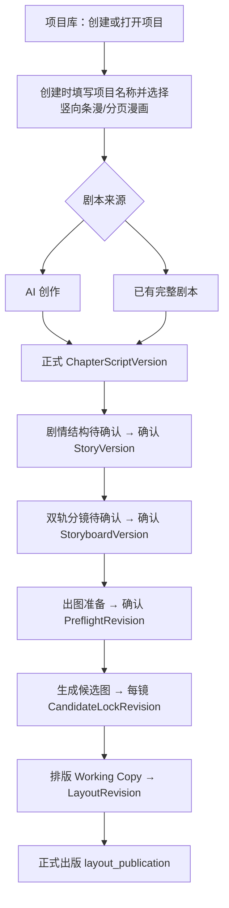

# AI漫游当前已实现完整流程

## 1. 总结论

当前真正完成并可按用户路径串起来的闭环是：

```text
项目库
  → 创建项目并锁定漫画版式
  → AI 创作 / 已有完整剧本导入
  → 逐章形成正式章节剧本
  → 逐章确认剧情结构
  → 逐章确认漫画+漫剧双轨分镜
  → 出图准备
  → 生成候选图并逐镜定稿
  → 排版、保存不可变版本并正式出版
```

正式完成点是第 6 步的 `layout_publication`。第 7 步素材包保留导航和旧目录骨架，但正式 G6 ZIP、下载和 `PackageRevision` 尚未完成，不进入本文主流程。轻漫剧只在分镜中提前保存基础 `motion` 字段，TTS、字幕、时间轴和 MP4 不进入当前已实现流程。

## 2. 用户视角总流程



项目工作区顶部仍显示七步：剧本、剧情结构、分镜工作台、出图准备、候选图工作台、排版导出、素材包。等待阶段不可点击；只有前置正式产物满足条件后，下一步才变为可进入状态。

## 3. 项目入口

1. 用户先进入项目库，不直接进入 AI 对话。
2. 创建项目只填写项目名称和漫画版式。
3. 漫画版式只允许“竖向条漫”或“分页漫画”，创建后不可直接修改。
4. 创建成功后直接进入项目工作区第 1 步“剧本”，系统已经有默认第 1 章。
5. 项目库支持打开和删除项目；删除需要二次确认，并通过后台清理项目数据和文件。
6. 项目工作区采用左侧阶段对话框、右侧当前阶段工作区；排版阶段改为完整画布。

## 4. 剧本路线 A：AI 创作

### A1 判断用户当前需要

- 没有明确题材：进入灵感候选。
- 已有明确题材：跳过灵感，直接进入项目大纲。
- 输入的是完整原稿：转入已有剧本路线。
- 只有真正阻断下一阶段的问题才追问；普通不确定性不反复询问。

### A2 灵感候选

1. 固定生成 3 个有实质差异的候选。
2. 页面继续展示现有标题、类型、梗概、核心冲突、视觉钩子和第一章方向。
3. P1 质量门在后台淘汰只换名字、冲突重复或缺少视觉承诺的伪差异方案。
4. 用户选择一个方向，或要求换一批；不做候选合并和单候选字段编辑。

### A3 项目大纲与章节安排

1. AI 生成一份项目级 Markdown 大纲。
2. 大纲含基础信息、主要角色、情节发展、结局方向，以及等量轻量章节卡。
3. 每张章节卡包含：标题、本章目标、核心冲突、关键转折、结尾钩子、下一章衔接。
4. 用户通过对话要求修改时，系统产生完整新候选；确认最新版本后才可生成章节。
5. P2 在后台检查因果链、结局兑现、章节功能差异和终章收束。

### A4 显式生成当前章节

1. 确认大纲不会自动生成任何章节正文。
2. 用户切换章节也不会自动生成。
3. 只有用户在当前章节明确输入“生成当前章节”，才生成该章 AI pending。
4. 系统读取确认大纲、当前章节卡；第 2 章起还必须读取上一章当前正式正文。
5. P3 检查场景是否有动作、冲突、变化和有效结束点；P5 检查是否承接上一章。
6. 目标章已有正式正文、非空 Working Copy 或其他待确认稿时，拒绝重复生成。

### A5 查看、采用、编辑和完成

1. AI pending 在正文区完整只读展示。
2. 用户可“采用草稿”或“丢弃”。
3. 采用后正文进入可编辑 Working Copy；这时才允许手动编辑和保存草稿。
4. 用户也可以在对话中明确要求改写；P4 按连续性、发展性、场景与对白、文字四层选取最高层处理，生成新的待采用 revision pending，不直接覆盖正文。
5. 第 2 章起的 AI 改写还检查已存在的前章承接不能被本次修改弄丢。
6. 用户点击“完成本章”后，才发布不可变正式 `ChapterScriptVersion`。
7. 页面停留在刚完成的章节；如果大纲还有下一张章节卡，只增加下一章下拉入口，不自动切换或生成。

## 5. 剧本路线 B：已有完整剧本

### B1 保存原稿

1. 用户通过对话上传 `.txt/.md` 或粘贴完整剧本。
2. 系统保存不可变原稿版本、文档和稳定原稿块。
3. 原稿不会被 AI 分析结果覆盖。

### B2 分析与拆章候选

1. AI 只观察原稿，生成观察性大纲、章节边界候选、原文范围、边界证据、警告和阻断问题。
2. 不为了套三幕式、黄金钩子或固定章长改写原稿。
3. 用户反馈后生成完整新候选，旧候选保留，不局部手改目录。
4. 超长原稿按稳定块分层分析和递归合并，技术分段不能冒充剧情章节边界。

### B3 整体确认拆章目录

1. 用户只需对整本最新拆章目录确认一次。
2. 系统创建不可变章节映射、全部章节入口、一个导入批次和逐章批次项。
3. 目录确认不等于批准各章正文。

### B4 后台逐章整理与忠实度验证

1. 目录确认请求落库后立即返回，后台 Worker 逐章整理并验证。
2. 每章成功后形成密封的 `kind=import` 待确认稿。
3. 单章失败不回滚其他章节；结果卡显示失败状态并提供“重试本章”。
4. 服务重启后可恢复未完成批次。

### B5 自由查看、逐章确认

1. 用户可以自由切换所有章节，完整只读查看整理后的章节草稿。
2. 不限制检查顺序和次数。
3. 导入待确认稿不提供采用、丢弃、手动修改、AI 重新整理、保存草稿或完成本章。
4. 用户点击某章“确认章节”，该章直接形成 `ChapterScriptVersion(origin=import)`。
5. 其他章节继续保持待确认或失败状态，不阻塞已经确认章节进入剧情结构。

## 6. 两条路线的汇合点

两条路线只在以下正式产物汇合：

```text
用户已确认的 ChapterScriptVersion
```

从这里开始，下游不再区分它来自 AI 创作还是原稿导入。任何 pending、未发布 Working Copy 或导入草稿都不能生成正式剧情结构。

## 7. 单章生产流水线

| 阶段 | 用户实际操作 | 形成的正式事实 | 进入下一步条件 |
| --- | --- | --- | --- |
| 剧本 | 采用并编辑后“完成本章”，或导入稿“确认章节” | `ChapterScriptVersion` | 正式版本为 current、Working Copy clean、无 pending |
| 剧情结构 | 生成待确认结构，查看/字段编辑，确认结构 | `StoryVersion` + StoryStructure | 精确绑定当前 ScriptVersion |
| 分镜 | 生成待确认分镜，编辑字段、拖拽排序、新增/删除镜头，确认分镜 | `StoryboardVersion` + `Shot[]` | 精确绑定当前 StoryVersion |
| 出图准备 | 检查角色、场景、画风；补齐必需角色定稿；确认可出图 | `PreflightRevision` | 正式分镜 current，阻断项清零 |
| 候选图 | 按镜头生成 1～6 张或批量生成；收藏、废弃、预览影响、定稿/更换/清空 | 每镜线性 `CandidateLockRevision` | 所有镜头都有当前有效定稿并完成图片阶段 |
| 排版出版 | 初始化排版、编辑画格/图片/文字/气泡、保存版本、预检、正式出版 | `LayoutRevision`、`ExportRevision(layout_publication)`、正式 `Asset` | 版面来源 current，错误清零，警告已确认 |

项目按章推进，不要求全书所有章节先完成剧本。第 1 章可以已经出版，第 2 章仍停留在剧本待确认。

## 8. 剧情结构阶段

1. 只读取当前正式章节正文，项目大纲只能辅助理解，不能补写正文未发生事件。
2. 生成内容包括本章摘要、方向、角色卡、场景卡、剧情节拍和分镜提醒。
3. 右侧先显示待确认预览；未确认前不能生成分镜。
4. 用户可在结构表中字段级编辑，再确认正式版本。
5. 确认时优先关联项目角色库；新角色同步为项目 `Character`，并排队生成第一张角色图。
6. 场景参考图可以在剧情结构页生成。

## 9. 项目角色库

角色库是项目级常驻资产入口，不是七步中的独立一步。

- `Character` 是唯一正式角色事实源。
- 剧本大纲和剧情结构发现的角色会进入角色库；已有角色按身份复用，避免重复。
- 用户可以查看或调整角色形象描述/Prompt、生成预览图和四要素角色定稿组合图。
- 删除角色图片只删除当前图片版本，不删除角色。
- 角色图不阻塞剧情结构；真正的硬门放在出图准备。
- 主角和常驻角色要求定稿图；其他角色按本章实际出镜要求判断。

## 10. 分镜阶段

1. 分镜只读取已确认 StoryVersion。
2. 每个 Shot 同时保存核心字段、漫画 `comic` 表达和基础漫剧 `motion` 表达。
3. 漫画字段负责画格描述、构图、对白/旁白和阅读节奏；漫剧字段负责画面持续、运镜、配音台词和画面类型。
4. 用户可以编辑、拖拽重排、新增和删除待确认镜头。
5. 未确认分镜不能进入出图准备和候选图生成。
6. 当前只完成“为未来漫剧保留镜头数据”，未生成视频成片。

## 11. 出图准备与候选图

出图准备检查：

- 镜头角色是否能匹配项目角色库。
- 必需角色是否有可用定稿图。
- 镜头场景是否引用本章正式场景卡。
- 场景参考图是否存在；缺图目前为建议，不是硬阻断。
- 项目版式和画风上下文是否可用。

候选图工作台已实现：

- 服务端完整 Prompt 只读预览。
- 单镜头多候选和未锁定镜头批量生成。
- 每次生成按任务分批保留历史。
- 候选收藏/取消收藏、废弃/恢复，不影响正式下游。
- 首次定稿、更换定稿、清空定稿、定稿历史。
- 更换前展示受影响排版、导出和运行任务；确认后只创建新修订，不覆盖旧产物。

## 12. 排版与正式出版

1. 从当前镜头定稿建立排版 Working Copy，支持按镜头批量排版或套用受控模板。
2. 支持页面/条漫段落、画格、自由图片、非破坏裁切、对象层级、锁定/隐藏、横竖排富文本和四类气泡。
3. 编辑草稿可撤销/重做并自动保存；自动保存不等于正式版本。
4. 用户点击“保存版本”，通过预检后形成不可变 `LayoutRevision`。
5. 定稿图后续被更换时，相关画格显示来源已变化；用户预览并显式替换，旧布局和旧导出保留。
6. 正式出版只读取当前不可变 LayoutRevision，通过持久任务确定性渲染。
7. 分页漫画产出逐页 PNG 和出版配置允许的 PDF；竖向条漫产出 PNG 切片及能力允许时的长图。
8. 出版历史可查看，排队或渲染中的出版任务可取消；手机提供只读预览。

## 13. 贯穿全流程的系统能力

### 13.1 版本与返修

- 正式 Script、Story、Storyboard、CandidateLock、Layout 和 Export 版本不可原地覆盖。
- 修改上游后，旧下游保留为历史，并根据精确来源 ID 和 digest 派生为 stale/historical。
- stale 产物不能继续创建新的正式下游任务，必须重新确认、重生成或显式解决来源。

### 13.2 持久任务

- 图片、角色、场景和正式出版等任务保存到 SQLite。
- 支持 queued/running/retrying/succeeded/failed/cancelled 状态、不可变 Attempt、有限重试、重启恢复和并发槽。
- 任务完成时再次核对来源；如果上游已经变化，结果只能归入历史，不能覆盖 current。

### 13.3 AI 对话与 Prompt

- 各步骤共用对话框组件，但历史按项目、步骤和章节隔离。
- 跨步骤只共享用户已经确认的正式事实，不共享未落地聊天内容。
- 创作、导入、章节修订、剧情结构、双轨分镜和图片 Prompt 的生产事实源位于 `apps/server/opencodeAI/skills/`。
- AI 不能直接写数据库 ID、物理文件路径或绕过业务确认门。

## 14. 本次明确排除的未完成能力

以下内容不进入“当前已实现完整流程”：

- 正式 G6 素材包 V2、真实 ZIP、下载、`PackageRevision` 和完整摘要审计。
- 第七步 `exported` 的完整七阶段总验收。
- TTS、字幕、BGM、视频时间轴、FFmpeg MP4 和完整轻漫剧生产。
- 一键生成整部漫画、自动跨步骤推进和整章批量调度。
- 手动新建、重命名、删除章节的完整产品能力。
- 导入章节的手动修改或 AI 重新整理。
- 多人协作、云端多用户、商业权限和复杂分支合并。

## 15. 一致性检查结论

### 已一致

- 产品主流程、前端路由、Shared 七步枚举和服务端工作流顺序一致。
- A/B 两条剧本路线在正式 `ChapterScriptVersion` 汇合，StoryStructure 字段没有被复制。
- 剧本、结构、分镜、出图准备、候选定稿和排版出版都存在正式确认门。
- G4 候选返修、G5 正式出版和 SQLite 持久任务均有实际代码、接口和验收证据。

### 文档漂移

`文档/00_索引/全流程与字段清单.md` 的部分“当前状态”段落仍停留在 G3/G4/G5 实施前，仍写有 G4/G5 未实现、任务为内存 Map、DB-only 尚未切换等历史结论。该文件应视为混有历史快照，当前状态应优先采用：

1. `文档/00_索引/AI上下文入口.md`
2. `文档/05_执行与记录/路线图与里程碑.md`
3. `文档/05_执行与记录/功能完成记录/2026-07-15_G0至G5阶段完成.md`
4. `文档/02_架构与契约/2026-07-16_双流程来源与状态契约.md`
5. 当前代码和测试

## 16. 复核证据

- 当前分支最新提交：`0556d9d feat: 归位章节修订与剧本导入提示词`。
- 2026-07-18 全项目完成度审计：Shared 153、Server 722、File Playwright 4/4、DB-only Playwright 13/13，类型检查、构建、Prisma、迁移和渲染门禁通过。
- 2026-07-16 双剧本路线 P6：两条 DB-only 用户路径通过。
- 2026-07-15 G0～G5：静态复核、运行复核和用户签收均通过。
- 本次没有修改功能代码，也没有调用真实文本或图片供应商；运行结论复用上述新鲜验收证据。
